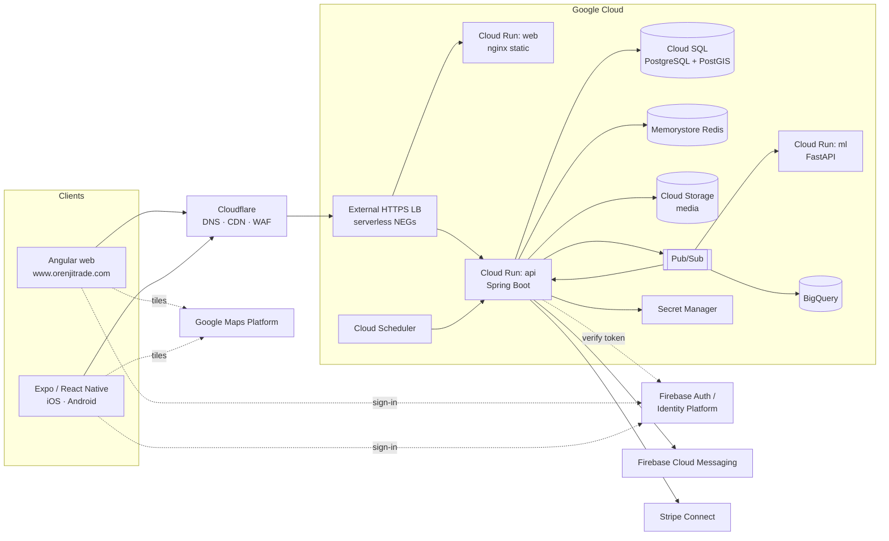
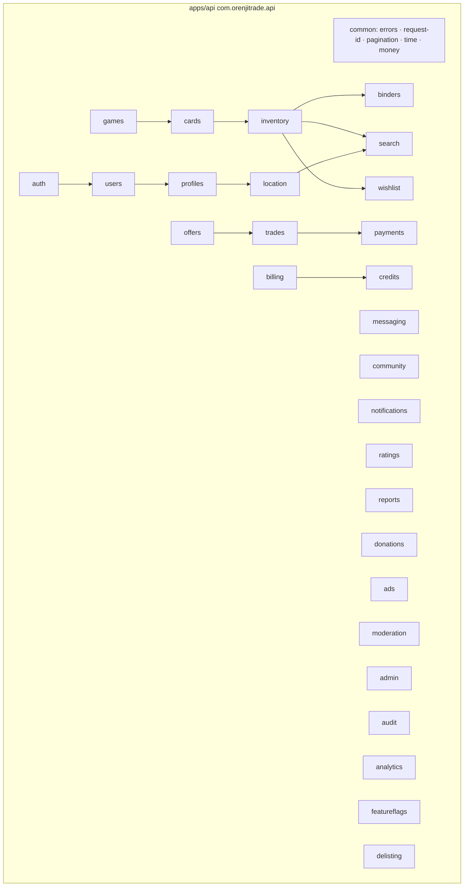
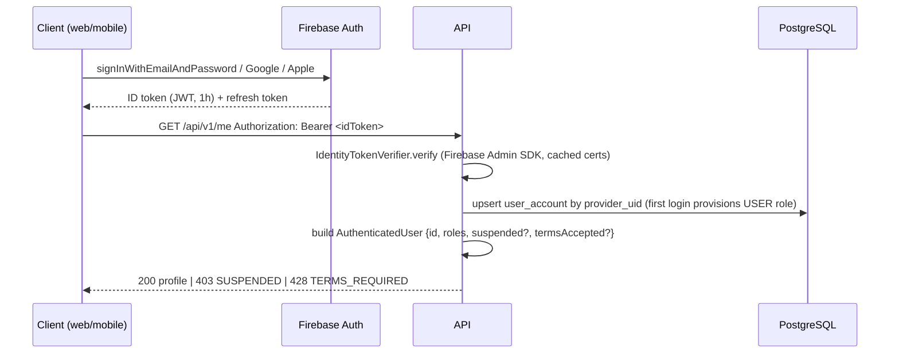
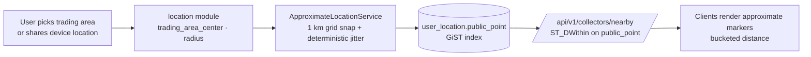
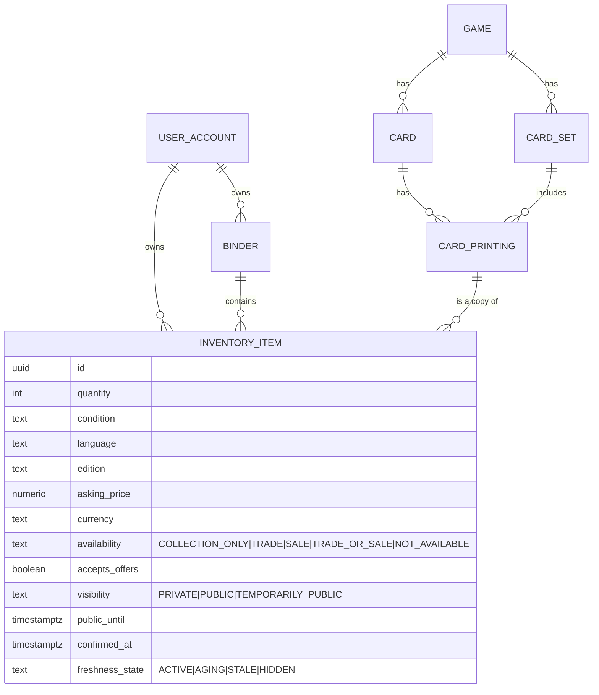
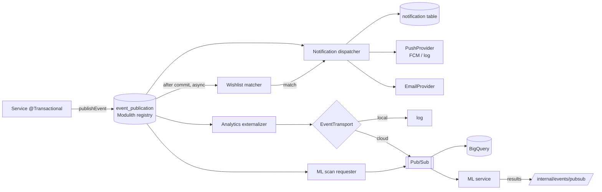
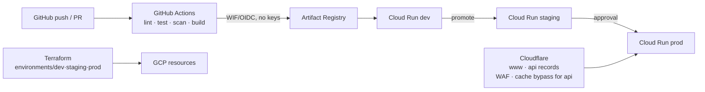

# OrenjiTrade — System Architecture

OrenjiTrade is a geographic discovery network for trading cards: collectors publish binders and
find each other on a map at approximate positions. This document is the map of the system;
decisions are recorded in [ADRs](adr/README.md).

## 1. System context

Domains: `www.orenjitrade.com` (web + `/admin`), `api.orenjitrade.com` (REST + WebSocket).
The ML service is internal only (Pub/Sub + authenticated service-to-service calls).

## 2. Repository and application boundaries

| Path | Runtime | Responsibility |
| --- | --- | --- |
| `apps/api` | Spring Boot 4.1 / Java 21 | All business logic, persistence, authorization, events |
| `apps/web-angular` | Angular 22 | Desktop/responsive web UI incl. admin console |
| `apps/mobile` | Expo SDK 58 | Native mobile UI (bottom tabs, camera, push) |
| `apps/ml` | FastAPI / Python | Card identification, duplicate detection, future ranking |
| `packages/api-client` | generated | Angular HttpClient services from OpenAPI |
| `packages/shared-types` | generated | TypeScript types from OpenAPI for mobile (+ `openapi-fetch`) |
| `packages/design-tokens` | CSS/TS | Colours, typography, spacing, radii, status colours |
| `infrastructure/terraform` | Terraform | GCP resources per environment |
| `infrastructure/docker` | Docker | Local emulators, Dockerfiles helpers |
| `infrastructure/cloudflare` | docs/IaC | DNS records, cache and WAF rules |

Dependency direction: clients → API contract (OpenAPI) → API. API → database/redis/cloud
adapters. API never depends on clients or on the ML service being available.

## 3. Backend modular monolith

Rules (see `CLAUDE.md`): one package per module with `api/ domain/ infra/ events/`; entities
never leave the module; cross-module reads go through the other module's service; writes that
must be decoupled go through domain events. `admin` and `audit` are cross-cutting consumers of
every module's service layer. `analytics` only consumes events.

### Request pipeline

`RequestIdFilter` → `SecurityFilterChain` (`BearerTokenAuthenticationFilter` → `IdentityTokenVerifier`
→ `UserAccountProvisioner`) → `RateLimitFilter` (Redis) → controller (DTO validation) →
service (`@PreAuthorize` + ownership checks + `@Transactional`) → repository →
`ProblemDetailsExceptionHandler` on failure (RFC 9457 with `errorCode`, `requestId`, `timestamp`).

## 4. Authentication flow

Roles (`USER`, `PREMIUM_USER`, `MODERATOR`, `ADMIN`, `SUPER_ADMIN`) live in `user_role`. Admin
routes additionally require a recent second factor. Local dev uses the Firebase emulator;
tests use a static verifier (ADR 0008).

## 5. Geographic privacy model

See [ADR 0004](adr/0004-collector-location-privacy.md). Summary:

Only `public_point` is ever read by public queries. Precise fields never reach DTOs, logs or
analytics. A contract test rejects coordinates with more than 3 decimals in any response.

### Card catalog and images

Card metadata comes from `CardProvider` adapters (`MockCardProvider` locally, `YgoProDeckCardProvider`
for the real Yu-Gi-Oh! catalog) and is always imported completely. Card images are separate: one
`card_image` row per provider artwork, a provider hosting policy (`REHOST_REQUIRED` /
`HOTLINK_ALLOWED`), a single `CardImageUrlResolver` for every DTO and a capped local cache (at most
5 GB = 5120 MiB since 2026-10-04, enough for the whole Yu-Gi-Oh! catalog at 320 px) served by
`GET /api/v1/public/card-images/{id}` — see
[ADR 0015](adr/0015-card-images-provider-hosting-capped-cache.md).

## 6. Inventory model

Effective visibility = item visibility ∩ binder visibility ∩ owner discoverability ∩ freshness
(`HIDDEN` items are excluded from public queries until reconfirmed). Freshness thresholds come
from `delist_policy` rows (ADR 0014). Nothing stale is deleted.

## 7. Events, notifications, background processing

Handlers are idempotent (notification dedup key = type + subject + recipient + day). Wishlist
matching is deterministic SQL: new public item × wishlist items (game/card/printing/condition/
price) × `ST_DWithin(public_point, wishlist owner public_point, radius)` × preferences.
Periodic jobs (`/internal/jobs/freshness`, `/internal/jobs/delist`) run via Cloud Scheduler in
the cloud and `@Scheduled` locally.

## 8. Analytics architecture

Application → `AnalyticsEvent` (schema-versioned JSON, no PII, grid-cell geography only) →
`EventTransport` → Pub/Sub `analytics-events` → BigQuery subscription → dataset
`orenjitrade_analytics` (partitioned by day, clustered by `event_type`). Transformations with
dbt later. Never query the transactional database for analytics.

## 9. ML architecture

`apps/ml` (FastAPI). Endpoints: `GET /health`, `POST /v1/identify` (image → ranked candidates
with confidence), `POST /v1/duplicates`. Consumes `card.scan.requested` events (Pub/Sub push)
and posts results back to the API. The API treats ML as optional: if unreachable, inventory
creation proceeds manually and scan requests are marked `ML_UNAVAILABLE`.

## 10. Deployment architecture

Environments: `local` (Docker Compose), `development`, `staging`, `production` (`ORENJI_ENV`;
the Spring profiles are `local`, `dev`, `staging`, `prod`) — separate GCP projects or at least
separate Cloud SQL instances, secrets and service accounts. Details in `docs/deployment/`.

First-year production profile (ADR 0016, 2026-10-05): one always-on `api` Cloud Run instance
with a Valkey sidecar as its Redis (no Memorystore until the scale-up path), Cloud SQL
`db-g1-small` ZONAL, Direct VPC egress (no connector, no Cloud NAT), the web service scaled to
zero, a Certificate Manager certificate behind Cloudflare, no `ml` service while Phase 11 is on
hold. The diagram above shows the full topology the modules can still produce.

## 11. Observability

Structured JSON logs with `requestId`, `userId` (hashed), `module`; Micrometer metrics to
Cloud Monitoring; `/actuator/health/liveness` and `/readiness`; alerts on HTTP 5xx rate,
p95 latency, DB connection saturation, Pub/Sub backlog age, notification/payment webhook
failures, ML failure rate, storage errors, auth failures.
