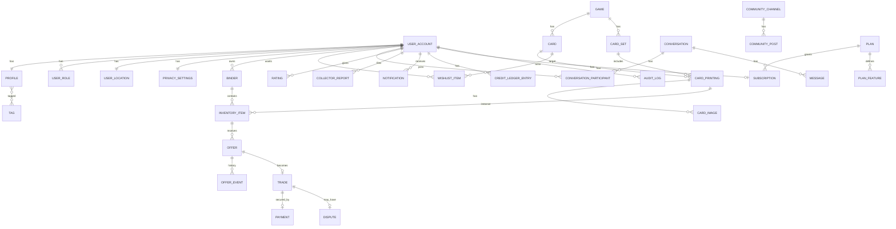

# Database schema

PostgreSQL 17 + PostGIS 3.5. Flyway migrations live in
`apps/api/src/main/resources/db/migration`. This document is kept in sync with migrations;
update it in the same change.

## Conventions

- Tables and columns are `snake_case`; primary keys are `uuid` (`gen_random_uuid()` or
  app-generated), never exposed sequential ids.
- Every table has `created_at timestamptz not null default now()`; mutable tables add
  `updated_at`. Soft-delete columns are named `deleted_at`.
- Enumerations are `text` columns with `CHECK` constraints (easier to evolve than PG enums).
- Money: `numeric(12,2)` + `currency char(3)`. Never floats.
- Geography: `geography(Point, 4326)` with GiST indexes. Distances in metres via `ST_DWithin`.
- Game-specific data: `jsonb` with GIN indexes when filtered.
- Search: generated `tsvector` columns + `pg_trgm` GIN indexes.
- Migration naming: `V<NNN>__<snake_case_description>.sql`, three-digit zero padded. Repeatable
  migrations (`R__`) only for views/functions. Never modify an applied migration.
- Seed data is not a migration; it lives in `db/seed/*.sql` and runs from `SeedDataRunner`
  under `local`/`dev` profiles only.

## Privacy-sensitive fields

| Table.column | Sensitivity | Rule |
| --- | --- | --- |
| `user_location.home_point` | Precise location | Never read outside `location` module, never serialised |
| `user_location.trading_area_center` | Approximate, user-chosen | Private |
| `user_location.public_point` | Derived imprecise | The only geography public queries may use |
| `user_account.email` | PII | Only owner + admins; hashed in analytics |
| `message.body`, `message_attachment` | Private content | Participants + moderators acting on a report |
| `payment_*` | Financial | Provider tokens only; never card numbers |

## Entity overview

Detailed column lists are appended per phase below as migrations land.

## Migrations

| Version | File | Purpose |
| --- | --- | --- |
| V001 | `V001__extensions.sql` | Extensions (`postgis`, `pg_trgm`, `unaccent`, `pgcrypto`) and the `unaccent_immutable(text)` helper |
| V002 | `V002__event_publication.sql` | Spring Modulith 2.1 event publication registry (`event_publication`, transactional outbox) |

(Sections for later phases are added as they are implemented.)

### V001 — extensions and helper functions

All statements are idempotent (`CREATE EXTENSION IF NOT EXISTS`, `CREATE OR REPLACE FUNCTION`), so
the migration also succeeds on a database that the local `docker compose` init script already
prepared.

| Object | Purpose |
| --- | --- |
| extension `postgis` | `geography(Point, 4326)` columns, `ST_DWithin`, GiST indexes (collector search) |
| extension `pg_trgm` | trigram GIN indexes for fuzzy card / collector name search |
| extension `unaccent` | accent-insensitive search (`Pokémon` matches `Pokemon`) |
| extension `pgcrypto` | `gen_random_uuid()` primary keys, `digest()` |
| function `unaccent_immutable(text) RETURNS text` | `IMMUTABLE PARALLEL SAFE STRICT` wrapper around `unaccent('public.unaccent', ...)`; required because `unaccent()` itself is only `STABLE` and therefore cannot back generated `tsvector` columns or expression indexes |

### V002 — `event_publication` (Spring Modulith outbox)

Copied verbatim from `spring-modulith-events-jdbc` 2.1.1 (`schemas/v2/schema-postgresql.sql`, the
current non-legacy structure). `spring.modulith.events.jdbc.schema-initialization.enabled` is
`false`: Flyway owns the table. Rows are written in the same transaction as the domain change and
completed (`completion-mode=update`) once every `@ApplicationModuleListener` succeeded; incomplete
rows are republished on restart. The optional `event_publication_archive` table
(`completion-mode=archive`) is not created.

| Column | Type | Notes |
| --- | --- | --- |
| `id` | `uuid` | PK |
| `listener_id` | `text` | fully qualified listener method |
| `event_type` | `text` | event class name |
| `serialized_event` | `text` | JSON (Jackson 3) |
| `publication_date` | `timestamptz` | when the event was published |
| `completion_date` | `timestamptz` | null while outstanding |
| `status` | `text` | `PUBLISHED`, `PROCESSING`, `RESUBMITTED`, `FAILED`, `COMPLETED` (managed by Modulith) |
| `completion_attempts` | `int` | retry counter |
| `last_resubmission_date` | `timestamptz` | last republish |

Indexes: `event_publication_serialized_event_hash_idx` (hash on `serialized_event`, used by
Modulith to complete publications) and `event_publication_by_completion_date_idx`
(`completion_date`, used to find outstanding / completed rows).
