# Database schema

PostgreSQL 17 + PostGIS 3.5. Flyway migrations live in
`apps/api/src/main/resources/db/migration`. This document is kept in sync with migrations;
update it in the same change.

## Conventions

- Tables and columns are `snake_case`; primary keys are `uuid` (`gen_random_uuid()` or
  app-generated), never exposed sequential ids.
- Every table has `created_at timestamptz not null default now()`; mutable tables add
  `updated_at`. Soft-delete columns are named `deleted_at`.
- Enumerations are `text` columns with `CHECK` constraints (easier to evolve than PG enums).
- Money: `numeric(12,2)` + `currency char(3)`. Never floats.
- Geography: **none** (ADR 0017). No application table has a geometry, geography, coordinate,
  radius, distance or grid-cell column; places are ISO codes (`country`, `subdivision`). PostGIS
  stays installed (V001) for future, non-personal use only.
- Game-specific data: `jsonb` with GIN indexes when filtered.
- Search: generated `tsvector` columns + `pg_trgm` GIN indexes.
- Migration naming: `V<NNN>__<snake_case_description>.sql`, three-digit zero padded. Repeatable
  migrations (`R__`) only for views/functions. Never modify an applied migration.
- Seed data is not a migration; it lives in `db/seed/*.sql` and runs from `SeedDataRunner`
  under `local`/`dev` profiles only.

## Privacy-sensitive fields

| Table.column | Sensitivity | Rule |
| --- | --- | --- |
| `user_location.country_code`, `.subdivision_code` | Self-declared place (ADR 0017) | Public as "state or province, country" only while the collector is discoverable; read through the location module |
| `user_location.city` | Optional free text, never geocoded | Returned to its owner (`GET /me/location`, `GET /me/export`) and shown **only** on the owner's public profile while `show_city`; never in lists, search, binders, offers, messages, notifications, admin lists, events, analytics or logs |
| `account_deletion_request.reason` | Free text from the owner | Never copied into the audit log; cleared when the deletion completes |
| `user_account.email` | PII | Only owner + admins; hashed in analytics |
| `message.body`, `message.payload`, `message_attachment`, `conversation.last_message_preview`, `image_upload` | Private content | Participants only (+ moderators acting on a report, Phase 7); never logged, never in events or analytics; export lists only the owner's own sent messages |
| `user_block.reason` | Private note | Never returned by the API (not even to the blocker), never logged or put into events |
| `community_post.removed_reason`, `community_reply.removed_reason`, `moderation_flag.resolution_note` | Moderator notes | Moderator console and audit log only |
| `payment_*` | Financial | Provider tokens only; never card numbers, CVV or bank details (Phase 9: amounts, statuses and provider references) |
| `seller_account.provider_account_id`, `payment.provider_ref`, `payment.payout_ref`, `payment_refund.provider_refund_id` | Provider references | Never returned to other members; the buyer's own fake checkout path carries its payment reference; admin views show statuses and amounts, never connected-account ids |
| `payment_webhook_event.payload` | Provider event as received (may carry billing contact data with Stripe) | Admin webhook detail only (`GET /admin/payments/webhooks/{id}`); lists omit it; never logged |
| `dispute.description`, `dispute_evidence.body`, `dispute_message.body`, `shipment.notes`, `shipment.tracking_number` | Free text of the two parties | The two parties and admins only (`GET /disputes/{id}`, `GET /trades/{id}`, admin dispute views); never in notifications, events, analytics or the audit log |
| `dispute_evidence.storage_key` (files under `disputes/<disputeId>/`) | Evidence photos (re-encoded JPEG, EXIF/GPS stripped) and PDF documents | Never public: `ObjectKeys.isPublic` refuses the `disputes` namespace and PDFs on `/public/media`; served only by `GET /disputes/{id}/evidence/{evidenceId}/file` to the parties and admins (`Cache-Control: private, no-store`) |
| `dispute_note.body`, `payment_refund.reason` | Staff free text | Admin console only; the audit log records ids, outcomes and amounts, never the text |
| `entitlement.note` | Admin free text | Admin console only; never returned to the account owner (`GET /me/plan` omits it) nor logged |
| `usage_counter` | Per-user usage | Owner (`GET /me/plan`) and admins only; never in analytics with the user id |
| `inventory_item.notes` | Private owner notes | Owner only (`GET /inventory/**`, `GET /me/export`); never in public responses (`PublicInventoryItem` has no such field), domain events or logs |
| `inventory_item_image` | Owner photos | Re-encoded JPEG, EXIF/GPS stripped before storage; public only while the item is effectively public; deleted with the item or the account |
| `inventory_freshness_event` | Owner activity trail | Owner/admin views only; purged with the account |
| `wishlist_item.public_note` | **Public** note of a wish (there is no private wishlist note any more: V112 dropped `wishlist_item.notes` without copying it) | Public wherever the wish is visible: the owner (`GET /wishlist`, `GET /me/export`) and, when the wishlist is shown, everyone who can see it (`GET /collectors/{handle}/wishlist`; "Who wants it" in stage S3). Plain text, moderated like profile text; never in notifications, events, analytics or logs |
| `wishlist_item` (rows) | What a collector is looking for | The owner always; others see the card, which copy (printing, or any printing with its optional rarity), the public note, "Near Mint only" and the price term through `GET /collectors/{handle}/wishlist` only when `privacy_settings.wishlist_visible` and no block. Wishlist alerts work for hidden wishlists and tell the wisher only |
| `notification.title`, `.body`, `.data` | Recipient-only content | Returned to the recipient only; never message text, private notes or coordinates; purged with the account |
| `push_token.token` | Device secret | Never returned by the API (export lists platform and dates only), never logged (the log provider logs the device count) |
| `collector_report.details`, `moderator_note.body`, `collector_report.resolution_note` | Reporter and moderator free text | Moderators and admins only (`/admin/reports/**`); never returned to the reporter or the reported collector, never in events or analytics (`collector_reported` carries reason and context source only); report details of decided reports are erased when the reporter's account is deleted |
| `collector_report.context.conversationId` | Pointer to a private conversation | Lets moderators read that conversation only, through the messaging module; each detail view is audited (`report.conversation.view`) |
| `rating.hidden_reason`, `reference.hidden_reason`, `user_responsiveness.pause_reason` | Moderator notes | Admin console and audit log only; the owner's listing status omits the pause reason |
| `rating.comment`, `reference.body` | Public member text | Public on the profile unless hidden; banned terms refused; never in analytics (`rating_submitted` has a comment flag only) |
| `user_account.banned_at` | Moderation decision | Admin views only |
| `offer.message`, `offer_event.reason`, `trade.cancel_reason` (and the `reason` of `trade_event.details`) | Free text of the two parties | Returned to the two parties only (`GET /offers/{id}`, `GET /trades/{id}`); never in notifications, SYSTEM messages, events or analytics; erased when their author's account is purged (the rows stay for the other party) |
| `offer.item_snapshot`, `offer_trade_item.item_snapshot`, `offer_event.snapshot` | Public form of negotiated cards and terms | Parties only; built from the public item fields (never `inventory_item.notes`, never a location) |
| `offer`, `trade` (rows) | Who negotiates or trades with whom | The two parties only (404 for anybody else); analytics get kinds, statuses and HMAC hashes only (`offer_created`, `offer_status_changed`, `trade_status_changed`), never amounts, ids or text |
| `subscription.provider_ref`, `subscription.checkout_ref`, `donation.provider_ref` | Provider references | Never returned to other members; a member's own fake checkout path carries its checkout reference; admin views show statuses and amounts, never subscription ids at the provider |
| `billing_webhook_event.payload`, `donation_webhook_event.payload` | Provider events as received | Admin detail views only; never logged |
| `credit_ledger_entry` (rows) | Credit history | Append-only (trigger refuses UPDATE, DELETE, TRUNCATE); owner and admins only; kept with the anonymised account after a purge |
| `credit_ledger_entry.note` | Admin free text | Admin ledger view only; never returned to the owner (`GET /me/credits` and the export omit it) |
| `advertiser.contact_email` | Business contact | Admin console only; never in ad responses |
| `ad_impression.user_hash`, `ad_click.user_hash`, `ad_conversion.user_hash` | Pseudonymous viewer id | HMAC of the account id (analytics actor hash); never an account id, never returned by the API; ad targeting reads the platform region and the viewer's country and subdivision codes (through the location module), never a city |
| `donation.message` | Donor free text | Admins and the donor's own export only; never public; erased on purge |
| `donation.public_thanks` | Opt-in | Only opted-in, active donors' display names (and month) are listed publicly; never amounts |
| `card_image.source_url` | Provider image URL | Server-side only (ADR 0015): never returned to members or visitors for `REHOST_REQUIRED` providers such as YGOPRODeck (clients get `/api/v1/public/card-images/{id}`) |
| Search region (not stored) | Platform region code of a scoped request | Validated against `platform_region`; never authorization; analytics get the region and subdivision codes only |

## Entity overview

```mermaid
erDiagram
  USER_ACCOUNT ||--|| PROFILE : has
  USER_ACCOUNT ||--o{ USER_ROLE : has
  USER_ACCOUNT ||--|| USER_LOCATION : has
  USER_ACCOUNT ||--|| PRIVACY_SETTINGS : has
  PROFILE }o--o{ TAG : tagged
  USER_ACCOUNT ||--o{ BINDER : owns
  BINDER ||--o{ INVENTORY_ITEM : contains
  GAME ||--o{ CARD : has
  GAME ||--o{ CARD_SET : has
  CARD ||--o{ CARD_PRINTING : has
  CARD_SET ||--o{ CARD_PRINTING : includes
  CARD ||--o{ CARD_IMAGE : artworks
  CARD_PRINTING ||--o{ CARD_IMAGE : has
  CARD_PRINTING ||--o{ INVENTORY_ITEM : instance
  USER_ACCOUNT ||--o{ WISHLIST_ITEM : wants
  CARD ||--o{ WISHLIST_ITEM : target
  USER_ACCOUNT ||--o{ CONVERSATION_PARTICIPANT : joins
  CONVERSATION ||--o{ CONVERSATION_PARTICIPANT : has
  CONVERSATION ||--o{ MESSAGE : has
  COMMUNITY_CHANNEL ||--o{ COMMUNITY_POST : has
  INVENTORY_ITEM ||--o{ OFFER : receives
  OFFER ||--o{ OFFER_EVENT : history
  OFFER ||--o| TRADE : becomes
  TRADE ||--o| PAYMENT : secured_by
  TRADE ||--o| DISPUTE : may_have
  USER_ACCOUNT ||--o{ INTERACTION : takes_part
  INTERACTION ||--o{ RATING : rated_by
  USER_ACCOUNT ||--o{ RATING : gives
  USER_ACCOUNT ||--o{ REFERENCE : writes
  USER_ACCOUNT ||--o| RATING_SUMMARY : summarised
  COLLECTOR_REPORT ||--o{ MODERATOR_NOTE : has
  USER_ACCOUNT ||--o| USER_RESPONSIVENESS : strikes
  USER_ACCOUNT ||--o{ COLLECTOR_REPORT : files
  USER_ACCOUNT ||--o{ NOTIFICATION : receives
  USER_ACCOUNT ||--o{ CREDIT_LEDGER_ENTRY : has
  USER_ACCOUNT ||--o| REFERRAL_CODE : shares
  USER_ACCOUNT ||--o{ SUBSCRIPTION : has
  PLAN ||--o{ SUBSCRIPTION : grants
  SUBSCRIPTION ||--o{ SUBSCRIPTION_EVENT : history
  ADVERTISER ||--o{ AD_CAMPAIGN : runs
  AD_CAMPAIGN ||--o{ AD_CREATIVE : has
  AD_CAMPAIGN ||--o{ AD_TARGETING_RULE : targets
  AD_PLACEMENT ||--o{ AD_CREATIVE : shows
  AD_CREATIVE ||--o{ AD_IMPRESSION : served
  USER_ACCOUNT ||--o{ DONATION : gives
  PLAN ||--o{ PLAN_FEATURE : defines
  USER_ACCOUNT ||--o{ AUDIT_LOG : actor
```

Detailed column lists are appended per phase below as migrations land.

## Migrations

| Version | File | Purpose |
| --- | --- | --- |
| V001 | `V001__extensions.sql` | Extensions (`postgis`, `pg_trgm`, `unaccent`, `pgcrypto`) and the `unaccent_immutable(text)` helper |
| V002 | `V002__event_publication.sql` | Spring Modulith 2.1 event publication registry (`event_publication`, transactional outbox) |
| V003 | `V003__users.sql` | Phase 1-A: `user_account`, `user_role`, `legal_document` (+ 8 seeded documents), `user_consent`, `audit_log`, `job_run` |
| V004 | `V004__profiles.sql` | Phase 1-B: `profile`, `tag` (+ 22 curated tags), `profile_tag`, `moderation_rule` (+ neutral placeholder banned terms), `privacy_settings`; trigram index on `user_account.handle` |
| V005 | `V005__location.sql` | Phase 1-B: `user_location` (ADR 0004: private centre, derived public point) |
| V006 | `V006__settings.sql` | Phase 1-B: `notification_preferences` |
| V007 | `V007__deletion.sql` | Phase 1-B: `account_deletion_request` |
| V010 | `V010__feature_flags.sql` | Phase 2: `feature_flag` (+ 7 default flags) |
| V011 | `V011__plans_limits.sql` | Phase 2 (Phase 10 foundation): `plan` (+ FREE, PREMIUM), `plan_feature`, `usage_limit` (+ contract limits), `usage_counter`, `entitlement`; `user_account.plan_code` → FK to `plan.code` |
| V012 | `V012__games.sql` | Phase 2: `game` (+ yugioh, pokemon, mtg, riftbound with their GameSchema) |
| V013 | `V013__catalog.sql` | Phase 2: `card_set`, `card`, `card_printing`, `card_image`, `catalog_sync_run`; FTS + trigram + JSONB GIN indexes |
| V020 | `V020__delist_policy.sql` | Phase 3: `delist_policy` (+ the single active default policy ACTIVE 0-14 / AGING 15-30 / STALE 31-45 / HIDDEN 46+ days, warn 5 days before hiding) |
| V021 | `V021__binder.sql` | Phase 3: `binder` (visibility, temporary publication, freshness, materialised public listing flag, generated `search_vector`) |
| V022 | `V022__inventory.sql` | Phase 3: `inventory_item`, trigger `trg_inventory_item_binder_count` (maintains `binder.item_count`), `inventory_item_image`, `inventory_freshness_event` |
| V030 | `V030__search_indexes.sql` | Phase 4: discovery and search indexes (`ix_inventory_item_owner_discovery`, `ix_inventory_item_printing_discovery`, `ix_privacy_settings_map`, `ix_binder_name_trgm`); no new table |
| V040 | `V040__messaging.sql` | Phase 5: `conversation`, `conversation_participant`, `conversation_pair` (unique DIRECT pair), `message`, `message_attachment`, `image_upload`, `user_block` |
| V041 | `V041__community.sql` | Phase 5: `community_channel` (+ the eight launch channels), `community_post`, `community_reply` |
| V042 | `V042__moderation_flags.sql` | Phase 5: `moderation_flag`, `ck_moderation_rule_rate_pattern`, message/post banned terms, rate and repeated-content rules |
| V050 | `V050__wishlist.sql` | Phase 6: `wishlist_item` (card or printing target, filters, radius, trade preference, private notes), `wishlist_match` (one row per wishlist item and inventory item) |
| V051 | `V051__notifications.sql` | Phase 6: `notification` (in-app rows + channel delivery state, unique `dedup_key`), `push_token` |
| V060 | `V060__ratings.sql` | Phase 7: `interaction` (rating eligibility), `rating`, `rating_summary`, `reference` |
| V061 | `V061__collector_reports.sql` | Phase 7: `collector_report`, `moderator_note`; `moderation_rule` kind REPORT_THRESHOLD and scope REPORT (+ report rate and threshold rules); `moderation_flag` reason REPORT_THRESHOLD; `user_account.banned_at` |
| V062 | `V062__listing_pauses_and_strikes.sql` | Phase 7: `user_responsiveness` (strikes and listing pauses); `delist_policy.unanswered_after_hours` |
| V063 | `V063__analytics_daily_count.sql` | Phase 7: `analytics_daily_count` (local analytics aggregate for the admin summary) |
| V070 | `V070__offers.sql` | Phase 8: `offer` (one row per proposal of a counter chain), `offer_trade_item`, `offer_event` (full history), `offer_preferences` (`accepts_mixed`); `uq_message_system_key` on `message` (SYSTEM messages of offers and trades) |
| V071 | `V071__trades.sql` | Phase 8: `trade` (one per accepted offer), `trade_event` (timeline) |
| V080 | `V080__payments.sql` | Phase 9: `platform_settings` (+ `payments.*`), `seller_account`, `payment`, `payment_event`, `payment_refund`, `payment_webhook_event` |
| V081 | `V081__shipments_disputes.sql` | Phase 9: `shipment`, `dispute`, `dispute_evidence`, `dispute_event`, `dispute_message`, `dispute_note` |
| V090 | `V090__subscriptions.sql` | Phase 10: `subscription` (one live per account), `subscription_event`, `billing_webhook_event` |
| V091 | `V091__credits.sql` | Phase 10: append-only `credit_ledger_entry` (trigger), view `credit_balance`, `credit_product` (+ 3 products), `referral_code`, `referral_redemption`, `credits.*` settings |
| V092 | `V092__advertising.sql` | Phase 10: `advertiser`, `ad_placement` (+ 5 placements), `ad_campaign`, `ad_creative`, `ad_targeting_rule`, `ad_impression`, `ad_click`, `ad_conversion`, `ad_campaign_daily` |
| V093 | `V093__donations.sql` | Phase 10: `donation`, `donation_webhook_event`, `donations.*` settings |
| V100 | `V100__card_image_cache.sql` | Card images (ADR 0015): `card_image` becomes one row per provider artwork (owner card/printing, provider id, server-side source URL, cache state), `card.image_id`, `card_image_cache_usage`, `card_image_cache_reservation`, `catalog_sync_run` image mode / provider version / phase / report |
| V101 | `V101__yugioh_catalog_fields.sql` | Real Yu-Gi-Oh! catalog: the printing variant key includes the rarity (`uq_card_printing_variant` becomes a unique index); the yugioh GameSchema gains rank, link rating/arrows, pendulum scale, property, archetype, frame, the complete monster types and common rarities |
| V102 | `V102__card_image_owner_compat.sql` | Backward compatibility: trigger `trg_card_image_fill_owner` derives `card_image.card_id` / `game_id` from `printing_id` when a writer that predates V100 omits them (older revisions during a rolling deploy, another checkout sharing the local database) |
| V103 | `V103__age_confirmation.sql` | Launch readiness (18+ rule): `legal_document.document_type` accepts `AGE_CONFIRMATION` (named constraint `ck_legal_document_type` replaces the unnamed V003 check) and the attestation row `AGE_CONFIRMATION` / `2026-10-05` (`required_at_registration = false`, `url = '/legal#age-confirmation'`) is inserted; confirmations are ordinary `user_consent` rows |
| V104 | `V104__consent_language.sql` | Launch readiness (French legal pages): `user_consent.language` (`en` / `fr`, default `en`, `ck_user_consent_language`) records which translation was shown when the consent was given; one `legal_document` version covers both languages |
| V105 | `V105__launch_money_flags_off.sql` | Launch configuration ("discovery + messaging only"): `feature_flag` rows `premiumPlans` and `credits` switched off as data (V010 had created them enabled); rows an admin already edited (`updated_by` set) are left alone; the local/dev seed switches them back on |
| V106 | `V106__platform_regions.sql` | ADR 0017: `platform_region`, `country`, `subdivision` (reference data of the location module, admin-editable country region / active flag) |
| V107 | `V107__platform_regions_seed.sql` | ADR 0017: 3 regions (default `americas-north`), 104 countries, 1,259 ISO 3166-2 subdivisions; generated by `scripts/regions/build.mjs` (see `docs/development/regions-boundaries.md`) |
| V108 | `V108__self_declared_location.sql` | ADR 0017: `user_location` dropped (private centre, radius, public point, label, grid cell, GiST index) and recreated as country + subdivision + optional city + `show_city`; every collector becomes not discoverable; `privacy_settings.show_distance` dropped |
| V109 | `V109__remove_distance_features.sql` | ADR 0017: `wishlist_item.radius_km` and `wishlist_match.distance_bucket` dropped (matches and match alerts deleted), the `map.radius.max_km` limit, entitlements and `map_radius_day` credit product deleted, plan copy updated, ad targeting by `REGION` / `COUNTRY` / `SUBDIVISION` (no `REGION_LABEL` / `GEO_CELL`), `ad_impression` / `ad_click` record `region_code` and `subdivision_code` instead of `geo_cell` |
| V110 | `V110__platform_region_channels.sql` | ADR 0017: the city REGION channels are archived; one REGION channel per platform region (`americas-north`, `americas-south`, `europe`) |
| V111 | `V111__region_model_comments.sql` | ADR 0017: database comments only (`rating_summary` no longer mentions the nearby ranking) |
| V112 | `V112__simplified_wishlist.sql` | Stage S2 (owner change of 2026-10-08, section 4): `wishlist_match` dropped with the WISHLIST_MATCH notifications and their limit notices; `wishlist_item` keeps only which copy (card, printing or any, rarity of "any printing" wishes) and gains `public_note` (≤ 280), `near_mint_only`, `price_term` (condition, edition, language, max price, currency, trade preference, private notes, `active`, `last_matched_at` dropped, data not migrated; paused wishes deleted; the selection normalised and same-selection duplicates collapsed to the oldest; `uq_wishlist_item_selection`; `ck_wishlist_item_target` dropped); `wishlist_alert_sent` (sent-alert key); `platform_settings` `wishlist.price_terms`; `notification_preferences.wishlist_alerts` (off for a collector whose `WISHLIST_MATCH` category had in-app and push off; the category key removed from `categories`); incomplete `event_publication` rows of `WishlistMatched` / `WishlistItemCreated` completed; `analytics_daily_count` rows of `wishlist_matched` deleted |

(Sections for later phases are added as they are implemented.)

### V001 — extensions and helper functions

All statements are idempotent (`CREATE EXTENSION IF NOT EXISTS`, `CREATE OR REPLACE FUNCTION`), so
the migration also succeeds on a database that the local `docker compose` init script already
prepared.

| Object | Purpose |
| --- | --- |
| extension `postgis` | installed only (ADR 0017): no application column uses it since V108 |
| extension `pg_trgm` | trigram GIN indexes for fuzzy card / collector name search |
| extension `unaccent` | accent-insensitive search (`Pokémon` matches `Pokemon`) |
| extension `pgcrypto` | `gen_random_uuid()` primary keys, `digest()` |
| function `unaccent_immutable(text) RETURNS text` | `IMMUTABLE PARALLEL SAFE STRICT` wrapper around `unaccent('public.unaccent', ...)`; required because `unaccent()` itself is only `STABLE` and therefore cannot back generated `tsvector` columns or expression indexes |

### V002 — `event_publication` (Spring Modulith outbox)

Copied verbatim from `spring-modulith-events-jdbc` 2.1.1 (`schemas/v2/schema-postgresql.sql`, the
current non-legacy structure). `spring.modulith.events.jdbc.schema-initialization.enabled` is
`false`: Flyway owns the table. Rows are written in the same transaction as the domain change and
completed (`completion-mode=update`) once every `@ApplicationModuleListener` succeeded; incomplete
rows are republished on restart. The optional `event_publication_archive` table
(`completion-mode=archive`) is not created.

| Column | Type | Notes |
| --- | --- | --- |
| `id` | `uuid` | PK |
| `listener_id` | `text` | fully qualified listener method |
| `event_type` | `text` | event class name |
| `serialized_event` | `text` | JSON (Jackson 3) |
| `publication_date` | `timestamptz` | when the event was published |
| `completion_date` | `timestamptz` | null while outstanding |
| `status` | `text` | `PUBLISHED`, `PROCESSING`, `RESUBMITTED`, `FAILED`, `COMPLETED` (managed by Modulith) |
| `completion_attempts` | `int` | retry counter |
| `last_resubmission_date` | `timestamptz` | last republish |

Indexes: `event_publication_serialized_event_hash_idx` (hash on `serialized_event`, used by
Modulith to complete publications) and `event_publication_by_completion_date_idx`
(`completion_date`, used to find outstanding / completed rows).

### V003 — accounts, roles, legal consents, audit log, job runs (Phase 1-A)

No location data lives in these tables (see ADR 0004); `user_location` arrives with the location
module. Enumerations are `text` + `CHECK` constraints; the Java side maps them with
`@Enumerated(STRING)`.

#### `user_account`

One row per identity-provider user, created on the first authenticated request
(`UserAccountService.resolve`, `INSERT ... ON CONFLICT (provider_uid) DO NOTHING`).

| Column | Type | Notes |
| --- | --- | --- |
| `id` | `uuid` | PK, app-generated (`gen_random_uuid()` default); seed accounts use `00000000-0000-4000-8000-0000000000NN` |
| `provider_uid` | `text` | Firebase uid, `UNIQUE` (`uq_user_account_provider_uid`); never shown to other users |
| `email` | `text` | PII: owner and admins only |
| `email_verified` | `boolean` | synced from the ID token on every login |
| `handle` | `text` | `[a-z0-9_]{3,24}` (`ck_user_account_handle`), unique case-insensitively via `uq_user_account_handle_lower` on `lower(handle)`; derived from the email local part with a numeric suffix on collision |
| `display_name` | `text` | initial value: provider name or the handle |
| `status` | `text` | `ACTIVE` (default), `SUSPENDED`, `DELETION_REQUESTED`, `DELETED` |
| `suspended_until` | `timestamptz` | null = indefinite; expired suspensions are lifted lazily on the next request |
| `suspension_reason` | `text` | admin-provided |
| `plan_code` | `text` | `FREE` (default) or `PREMIUM`; FK → `plan.code` since V011 (`fk_user_account_plan`, `ON UPDATE CASCADE`) |
| `created_at`, `updated_at` | `timestamptz` | |
| `last_active_at` | `timestamptz` | written at most once per 5 minutes per user (Redis `SET NX` throttle) |
| `deleted_at` | `timestamptz` | set by the deletion job |

Indexes: `ix_user_account_email_lower`, `ix_user_account_status`, `ix_user_account_created_at`.

#### `user_role`

| Column | Type | Notes |
| --- | --- | --- |
| `user_id` | `uuid` | FK → `user_account.id` (cascade) |
| `role` | `text` | `USER`, `PREMIUM_USER`, `MODERATOR`, `ADMIN`, `SUPER_ADMIN`; PK `(user_id, role)` |
| `granted_at` | `timestamptz` | |
| `granted_by` | `uuid` | acting admin, null for provisioning/seed |

Every account keeps `USER`. Only a `SUPER_ADMIN` may grant or revoke `ADMIN`/`SUPER_ADMIN`.

#### `legal_document`

| Column | Type | Notes |
| --- | --- | --- |
| `id` | `uuid` | PK |
| `document_type` | `text` | `TERMS`, `PRIVACY`, `COMMUNITY_GUIDELINES`, `MARKETPLACE_POLICY`, `PAYMENT_PROTECTION`, `REFUND_DISPUTE`, `COOKIES`, `ACCEPTABLE_USE`, `AGE_CONFIRMATION` (V103, constraint `ck_legal_document_type`) |
| `version` | `text` | e.g. `2026-09-01`; `UNIQUE (document_type, version)` |
| `title`, `url` | `text` | `url` is the web path (`/legal/terms`); `/legal#age-confirmation` for the attestation (not a page, and never mapped to an in-app text by the clients) |
| `required_at_registration` | `boolean` | `true` for TERMS, PRIVACY, COMMUNITY_GUIDELINES, ACCEPTABLE_USE; `false` for `AGE_CONFIRMATION` on purpose (the service layer gates on it instead of the terms filter) |
| `published_at` | `timestamptz` | |
| `current` | `boolean` | at most one current version per type (`uq_legal_document_current`, partial unique index) |

V003 seeds the eight documents in version `2026-09-01`; V103 adds the 18+ attestation
`AGE_CONFIRMATION` in version `2026-10-05`. Publishing a new version = insert the row and flip
`current` in one transaction; every user then sees it in `requiredConsents` and receives
`428 TERMS_ACCEPTANCE_REQUIRED` on non-exempt routes until they accept it. The age attestation
is different: any recorded version counts (`ConsentService.hasConfirmedAge`), and a missing one
answers `403 AGE_CONFIRMATION_REQUIRED` only on becoming discoverable, messaging, community
posting and offers.

#### `user_consent`

| Column | Type | Notes |
| --- | --- | --- |
| `id` | `uuid` | PK |
| `user_id` | `uuid` | FK → `user_account.id` (cascade) |
| `document_type`, `version` | `text` | FK → `legal_document (document_type, version)`; `UNIQUE (user_id, document_type, version)` |
| `accepted_at` | `timestamptz` | |
| `ip_hash` | `text` | SHA-256 hex of `<server salt>:<client IP>` (`orenji.consents.ip-salt`); the raw address is never stored |
| `user_agent` | `text` | truncated to 512 characters |
| `language` | `text` | `en` or `fr` (V104, `ck_user_consent_language`, default `en`): the language of the legal text shown when the consent was given. The French pages are a translation of the English draft, so one `legal_document (document_type, version)` row covers both languages and the consent records version + language |

Consents survive account deletion (the account row is anonymised instead).

#### `audit_log`

Append-only; written by `AuditService.record` inside the caller's transaction.

| Column | Type | Notes |
| --- | --- | --- |
| `id` | `uuid` | PK |
| `occurred_at` | `timestamptz` | |
| `actor_user_id` | `uuid` | acting account, null for `SYSTEM` |
| `actor_type` | `text` | `USER`, `ADMIN`, `SYSTEM` |
| `action` | `text` | dotted name: `user.suspend`, `user.unsuspend`, `user.roles.update`, `user.suspension.expired`, `consent.accept`, ... |
| `target_type` | `text` | e.g. `USER` |
| `target_id` | `text` | id of the target as text |
| `details` | `jsonb` | structured, PII-free details (never coordinates) |
| `request_id` | `text` | the `X-Request-Id` of the triggering request |

Indexes: `ix_audit_log_target (target_type, target_id)`, `ix_audit_log_actor (actor_user_id)`,
`ix_audit_log_occurred_at (occurred_at DESC)`, `ix_audit_log_action (action)`.

#### `job_run`

Execution record of internal jobs (`/internal/jobs/**`, scheduled tasks), written by
`JobRunService`.

| Column | Type | Notes |
| --- | --- | --- |
| `id` | `uuid` | PK |
| `name` | `text` | job name (`ping`, later `account-deletion`, `auto-delist`, ...) |
| `started_at`, `finished_at` | `timestamptz` | |
| `status` | `text` | `RUNNING` (default), `SUCCEEDED`, `FAILED` |
| `details` | `jsonb` | counters or an error summary |

Index: `ix_job_run_name_started_at (name, started_at DESC)`.

### V004 — profiles, tags, moderation rules, privacy settings (Phase 1-B)

#### `profile`

One row per account once the collector saved a profile, uploaded an avatar or set tags. The handle
stays on `user_account`; the display name is mirrored there (shown by `/me` and admin views).

| Column | Type | Notes |
| --- | --- | --- |
| `user_id` | `uuid` | PK, FK → `user_account.id` (cascade) |
| `display_name` | `text` | 1-80 characters (`ck_profile_display_name`); public |
| `bio` | `text` | ≤ 500 characters (`ck_profile_bio`), default `''`; public; banned-term checked (`PROFILE` rules) |
| `avatar_key` | `text` | `ObjectStorage` key `avatars/<user id>/<32 hex>.jpg` of the 512×512 re-encoded avatar; never a server path. The public URL is derived at read time (local: `GET /api/v1/public/media/{key}`, GCS: bucket URL) |
| `games` | `text[]` | slugs of ACTIVE rows of `game` (validated by the service through the games module's `GameCatalog`, V012); ≤ 16 (`ck_profile_games`) |
| `languages` | `text[]` | ISO 639-1 codes; ≤ 10 (`ck_profile_languages`) |
| `completed_at` | `timestamptz` | first `PUT /me/profile` (onboarding flag `profileComplete`) |
| `created_at`, `updated_at` | `timestamptz` | |
| `search_vector` | `tsvector` | generated: `to_tsvector('simple', unaccent_immutable(display_name || ' ' || bio))` (collector search, Phase 4) |

Indexes: `ix_profile_search_vector` (GIN), `ix_profile_display_name_trgm` (GIN trigram on
`lower(unaccent_immutable(display_name))`), `ix_profile_games` (GIN on the array). V004 also adds
`ix_user_account_handle_trgm` (GIN trigram on `user_account.handle`).

#### `tag`

| Column | Type | Notes |
| --- | --- | --- |
| `id` | `uuid` | PK |
| `slug` | `text` | `UNIQUE` (`uq_tag_slug`), `^[a-z0-9]+(-[a-z0-9]+)*$`, ≤ 48 characters; custom labels map to the accent-free, dashed slug so "Cube Drafter" and "cube-drafter" are the same tag |
| `label` | `text` | 2-24 characters |
| `category` | `text` | `GAME`, `ROLE`, `STYLE`, `LOGISTICS`, `LANGUAGE`, `CUSTOM` |
| `status` | `text` | `ACTIVE` (default; searchable and selectable), `HIDDEN` (kept on profiles, not shown), `BANNED` |
| `usage_count` | `integer` | profiles carrying the tag; recomputed from `profile_tag` on every change (`TagRepository.recountUsage`) |
| `created_by` | `uuid` | creator of a `CUSTOM` tag, FK → `user_account.id` (`ON DELETE SET NULL`) |
| `created_at`, `updated_at` | `timestamptz` | |

Indexes: `ix_tag_label_trgm` (GIN trigram on `lower(unaccent_immutable(label))`, tag search),
`ix_tag_status_usage (status, usage_count DESC)`, `ix_tag_category`. V004 seeds 22 curated tags
(games, roles, styles, logistics, languages). `GET /tags` only returns `ACTIVE` tags, and `CUSTOM`
ones only while at least one profile uses them.

#### `profile_tag`

| Column | Type | Notes |
| --- | --- | --- |
| `profile_user_id` | `uuid` | FK → `profile.user_id` (cascade) |
| `tag_id` | `uuid` | FK → `tag.id` (cascade); PK `(profile_user_id, tag_id)` |
| `created_at` | `timestamptz` | |

Index: `ix_profile_tag_tag_id`. At most 12 tags per profile (service rule).

#### `moderation_rule`

Admin-editable text rules (ADR 0014), cached ≤ 60 s per instance by `TextModerationService`.

| Column | Type | Notes |
| --- | --- | --- |
| `id` | `uuid` | PK |
| `kind` | `text` | `BANNED_TERM` (evaluated today), `RATE_LIMIT`, `THRESHOLD` |
| `pattern` | `text` | 1-200 characters; case-insensitive regular expression matched against accent-stripped text; invalid patterns are skipped with a warning |
| `action` | `text` | `FLAG` (accepted, logged for review) or `BLOCK` (400) |
| `scope` | `text` | `MESSAGE`, `POST`, `TAG`, `PROFILE` |
| `active` | `boolean` | |
| `created_at`, `updated_by`, `updated_at` | | audit columns |

Index: `ix_moderation_rule_scope_active (scope, active)`. V004 seeds invented, neutral placeholder
terms (`zorblax`, `quuxspam`, `blorpscam` → `BLOCK` for `TAG` and `PROFILE`; `fnordpromo` → `FLAG`
for `PROFILE`) that exercise the engine locally; real lists are managed through the admin console
(admin endpoints arrive with Phase 7 moderation).

#### `privacy_settings`

A missing row means the safe defaults below.

| Column | Type | Default | Notes |
| --- | --- | --- | --- |
| `user_id` | `uuid` | | PK, FK → `user_account.id` (cascade) |
| `discoverable` | `boolean` | `false` | opt-in to the map, search and holder lists; needs a declared country and state/province (`user_location`, ADR 0017: `409 LOCATION_REQUIRED` without them) and is turned off when the location is removed |
| `show_online_status` | `boolean` | `false` | presence (Phase 5) |
| `show_last_active` | `boolean` | `true` | bucketed last activity on the public profile |
| `profile_visibility` | `text` | `MEMBERS` | `PUBLIC`, `MEMBERS`, `PRIVATE` (404 for everyone but the owner) |
| `messaging_permission` | `text` | `MEMBERS_WITH_PROFILE` | `EVERYONE`, `MEMBERS_WITH_PROFILE`, `NOBODY` |
| `wishlist_visible` | `boolean` | `false` | Phase 6 |
| `search_discoverable` | `boolean` | `true` | collector name search (Phase 4) |
| `created_at`, `updated_at` | `timestamptz` | | |

Index: `ix_privacy_settings_discoverable` (partial, `WHERE discoverable`). The rules built on these
switches live in `PrivacyPolicyService` (profiles module).

### V005 — `user_location` (ADR 0004, replaced by V108)

> **Historical.** V108 (ADR 0017) dropped this table with its data and recreated `user_location`
> without any coordinate; see "V106–V108 — platform regions and the self-declared location"
> below. The original layout is kept here for reference only.

Read and written only by the location module (`UserLocationRepository`, explicit PostGIS SQL).

| Column | Type | Notes |
| --- | --- | --- |
| `user_id` | `uuid` | PK, FK → `user_account.id` (cascade) |
| `home_point` | `geography(Point, 4326)` | **PRIVATE**; reserved for an explicit "use my location" flow, never written by the Phase 1 API, never selected, serialised, logged or exported |
| `trading_area_center` | `geography(Point, 4326)` | **PRIVATE**, not null; the user-chosen centre rounded to 3 decimals; returned only to its owner |
| `trading_area_radius_m` | `integer` | 1 000-50 000 (`ck_user_location_radius`) |
| `source` | `text` | `MANUAL` or `DEVICE` (only records where the centre came from; the server snaps both) |
| `public_point` | `geography(Point, 4326)` | **PUBLIC**; derived by `ApproximateLocationService`: snap to the ~1 km cell (`row = floor(lat / 0.009)`, `col = floor(lng / (0.009 / cos(row centre lat)))`), offset inside the cell by `HMAC-SHA256(LOCATION_JITTER_SECRET, user id)` with a 0.001° margin, rounded to 3 decimals. Same user + same cell ⇒ same point. `NULL` while the collector is not discoverable, pending deletion or suspended |
| `public_label` | `text` | **PUBLIC** region label of the public point (`StaticRegionGeocoder`: ~34 Montréal-area neighbourhoods and Canadian cities, offline) |
| `grid_cell` | `text` | `r<row>c<col>`; `NULL` exactly when `public_point` is (`ck_user_location_public`); the only location value analytics may carry |
| `created_at`, `updated_at` | `timestamptz` | |

Indexes: `ix_user_location_public_point` (GiST, partial `WHERE public_point IS NOT NULL`, nearby
search in Phase 4), `ix_user_location_grid_cell` (partial).

### V106–V108 — platform regions and the self-declared location (ADR 0017)

Reference data and the declared place, owned by the location module (`RegionRepository`,
`UserLocationRepository`, plain SQL); read elsewhere only through `RegionCatalog`,
`LocationService` and the SPIs it implements. No coordinate of any kind.

| Table | Columns | Notes |
| --- | --- | --- |
| `platform_region` | `code` PK (`^[a-z]+(-[a-z]+)*$`), `name`, `sort_order`, `is_default`, `updated_at` | at most one default (`uq_platform_region_default`); `americas-north`, `americas-south`, `europe` |
| `country` | `code` PK (ISO 3166-1 alpha-2, `XK` for Kosovo), `name`, `region_code` FK, `active`, `sort_order`, `updated_by`, `updated_at` | admins move a country to another region or deactivate it (`PUT /admin/regions/countries/{code}`, audited `region.country.update`); inactive countries cannot be chosen, existing locations keep them |
| `subdivision` | (`country_code`, `code`) PK (ISO 3166-2, or the alpha-2 code of a whole-country pseudo-subdivision), `name`, `whole_country` | 1,259 rows (V107) |
| `user_location` | `user_id` PK/FK (cascade), `country_code` FK, `subdivision_code` (FK with the country), `city` (1-80 chars, trimmed, `ck_user_location_city`), `show_city` (default true), `created_at`, `updated_at` | `ix_user_location_subdivision`, `ix_user_location_country`; the city is never geocoded, logged or put into events |

The catalogue is cached in Redis (`regions:v1`, 60 s) with a 10 s in-process memo, evicted after
every admin write (`RegionsChangedEvent`).

### V006 — `notification_preferences`

A missing row means the defaults (push and in-app on, email off, `MARKETING` fully off).

| Column | Type | Notes |
| --- | --- | --- |
| `user_id` | `uuid` | PK, FK → `user_account.id` (cascade) |
| `push_enabled`, `email_enabled`, `in_app_enabled` | `boolean` | master switches (`true`, `false`, `true`) |
| `categories` | `jsonb` | object `{CATEGORY: {push, email, inApp}}` keyed by `MESSAGE`, `OFFER`, `RATING`, `TRADE`, `BINDER_FRESHNESS`, `REPORT_DECISION`, `MARKETING` (`WISHLIST_MATCH` until V112); missing keys mean the defaults, unknown keys are ignored when reading (`ck_notification_preferences_categories`: must be an object). Never filtered in SQL, so no GIN index |
| `wishlist_alerts` | `boolean` | V112: the one on/off switch of wishlist alerts (default `true`; V112 starts it `false` for a collector whose old `WISHLIST_MATCH` category had both in-app and push off); in-app and push follow the master switches and quiet hours, never email |
| `quiet_hours` | `jsonb` | object `{enabled, start "HH:mm", end "HH:mm", timezone}` (IANA zone validated by the service), default disabled 22:00-08:00 America/Toronto |
| `created_at`, `updated_at` | `timestamptz` | |

### V007 — `account_deletion_request`

`POST /me/deletion-requests` → `PENDING` (7-day grace period, account `DELETION_REQUESTED`, every
session revoked, public traces hidden) → `account-deletion` job → `COMPLETED` (account anonymised,
module data purged by every `DeletionParticipant`, identity-provider user deleted; consents and audit
kept), or `CANCELLED` by the owner during the grace period.

| Column | Type | Notes |
| --- | --- | --- |
| `id` | `uuid` | PK |
| `user_id` | `uuid` | FK → `user_account.id` (cascade; account rows are anonymised, never deleted) |
| `status` | `text` | `PENDING`, `PROCESSING` (reserved), `COMPLETED`, `CANCELLED` |
| `reason` | `text` | optional owner text ≤ 1 000 characters; never audited; set to `NULL` on completion |
| `export_requested` | `boolean` | the owner wants their export first (`GET /me/export` stays available while pending) |
| `requested_at`, `scheduled_for` | `timestamptz` | `scheduled_for = requested_at + orenji.account.deletion-grace-days` |
| `cancelled_at`, `completed_at` | `timestamptz` | |
| `created_at`, `updated_at` | `timestamptz` | |

Indexes: `uq_account_deletion_request_active` (unique partial on `user_id` for `PENDING`/`PROCESSING`:
one active request per account), `ix_account_deletion_request_due` (partial on `scheduled_for`
`WHERE status = 'PENDING'`, used by the job with `FOR UPDATE SKIP LOCKED`),
`ix_account_deletion_request_user (user_id, requested_at DESC)`.

Anonymisation (`UserAccount.anonymise`): `email = deleted+<id>@anonymized.invalid`,
`handle = deleted_<16 hex of the id>`, `display_name = 'Deleted collector'`, status `DELETED`,
`deleted_at` set, only `USER` kept, `last_active_at` cleared. `provider_uid` is kept on purpose (the
identity is deleted at the provider; a still-valid old ID token then resolves to the `DELETED` row and
gets 403 instead of provisioning a new account), and identity attributes are never re-synced onto a
deleted row.

### V010 — `feature_flag` (ADR 0014)

Runtime switches edited by `SUPER_ADMIN`s through `PUT /api/v1/admin/feature-flags/{key}` (audited
`feature_flag.update`). The whole table is cached in Redis (`orenji:cache:feature-flags:v1`, 60 s) and
evicted after every write, so all API instances apply a change at once.

| Column | Type | Notes |
| --- | --- | --- |
| `key` | `text` | PK, lowerCamelCase (`ck_feature_flag_key`: `^[a-z][a-zA-Z0-9]{1,63}$`) |
| `enabled` | `boolean` | master switch |
| `description` | `text` | ≤ 500 characters |
| `rollout_percent` | `integer` | 0-100 (`ck_feature_flag_rollout`); share of accounts seeing an enabled flag, bucket = `CRC32(key:userId) mod 100`; anonymous callers only see flags at 100 % |
| `updated_by` | `uuid` | FK → `user_account.id` (`ON DELETE SET NULL`); `NULL` for migration defaults and the local seed |
| `updated_at`, `created_at` | `timestamptz` | |

Seeded rows (V010): `mlScanning=false`, `protectedPayments=false`, `publicChat=true`,
`premiumPlans=true`, `advertising=false`, `credits=true`, `donations=false`. **V105 (launch
configuration, 2026-10-05) switches `premiumPlans` and `credits` off**, so a database migrated from
scratch has every money feature off and only `publicChat` on; a SUPER_ADMIN turns a money feature on
in `/admin > Feature flags` (`docs/deployment/runbooks.md`, "Launch configuration"). The local/dev
`FeatureFlagSeedContributor` enables `protectedPayments`, `premiumPlans`, `credits`, `advertising`
and `donations` (fake providers) unless an admin already edited them (`updated_by` set);
`mlScanning` stays off everywhere. A disabled flag makes guarded routes answer
`404 FEATURE_DISABLED` (extension `feature`).

### V011 — plans, plan features, usage limits, usage counters, entitlements (ADR 0014)

Foundation of the Phase 10 contract "Plans and limits" (subscriptions come with Phase 10). Rules are
cached in Redis (`orenji:cache:plans:v1`, per-user `orenji:cache:entitlements:v1:<userId>`, 60 s) and
evicted after every admin write.

#### `plan`

| Column | Type | Notes |
| --- | --- | --- |
| `id` | `uuid` | PK |
| `code` | `text` | `UNIQUE` (`uq_plan_code`), `^[A-Z][A-Z0-9_]{1,31}$`; referenced by `user_account.plan_code` |
| `name` | `text` | 1-80 characters |
| `description` | `text` | ≤ 1 000 characters |
| `monthly_price` | `numeric(12,2)` | display price, ≥ 0 |
| `currency` | `char(3)` | ISO 4217, default `CAD` |
| `active` | `boolean` | inactive plans are hidden from `GET /plans`; users on an inactive plan get the FREE rules; FREE cannot be disabled (service rule) |
| `sort_order` | `integer` | display order |
| `created_at`, `updated_by`, `updated_at` | | audit columns |

Seeded: `FREE` (0.00 CAD) and `PREMIUM` (4.99 CAD, placeholder price).

#### `plan_feature`

| Column | Type | Notes |
| --- | --- | --- |
| `plan_id` | `uuid` | FK → `plan.id` (cascade); PK `(plan_id, feature_key)` |
| `feature_key` | `text` | dotted lower-case key (`ck_plan_feature_key`), e.g. `filters.advanced`, `ads.enabled` |
| `enabled` | `boolean` | |
| `value` | `text` | optional parameter, ≤ 200 characters |
| `updated_by`, `updated_at` | | |

Seeded: FREE `filters.advanced=false`, `ads.enabled=true`; PREMIUM `filters.advanced=true`,
`ads.enabled=false`.

#### `usage_limit`

| Column | Type | Notes |
| --- | --- | --- |
| `id` | `uuid` | PK (admin edits address limits by id) |
| `plan_id` | `uuid` | FK → `plan.id` (cascade); `UNIQUE (plan_id, limit_key)` |
| `limit_key` | `text` | dotted lower-case key |
| `kind` | `text` | `COUNTER` (consumed per window) or `CAP` (bound of a requested value, e.g. radius) |
| `limit_window` | `text` | `DAY`, `MONTH`, `TOTAL` (the contract's `window`; renamed because `WINDOW` is reserved in PostgreSQL). DAY/MONTH start at 00:00 UTC; caps always use `TOTAL` (`ck_usage_limit_cap_window`) |
| `max_value` | `integer` | `NULL` = unlimited; ≥ 0 (0 blocks the action) |
| `description` | `text` | ≤ 500 characters |
| `updated_by`, `updated_at` | | |

Index: `ix_usage_limit_key`. Seeded limits (FREE / PREMIUM): `binder.views.per_day` 30 / unlimited,
`wishlist.alerts.per_day` 5 / unlimited, `wishlist.items.max` 20 / 500 (TOTAL),
`binders.max` 5 / 50 (TOTAL), `saved_searches.max` 0 / 50 (TOTAL), `offers.per_day` 20 / 100
(`map.radius.max_km` 25 / 100 (CAP) existed until V109 deleted it, ADR 0017).

#### `usage_counter`

| Column | Type | Notes |
| --- | --- | --- |
| `user_id` | `uuid` | FK → `user_account.id` (cascade) |
| `limit_key` | `text` | |
| `window_start` | `timestamptz` | start of the DAY/MONTH window; `1970-01-01T00:00Z` for TOTAL |
| `count` | `integer` | ≥ 0 |
| `updated_at` | `timestamptz` | |

PK `(user_id, limit_key, window_start)`; index `ix_usage_counter_window_start` (housekeeping).
`Limits.consume` increments with one atomic `INSERT ... ON CONFLICT DO UPDATE ... WHERE count < max
RETURNING count`, so concurrent requests can never pass the limit; the value is mirrored in Redis
(`orenji:usage:<user>:<key>:<window epoch>`, TTL ≤ 10 min, written after commit) for the `check` fast
path. TOTAL counters owned by another module (e.g. `binders.max` = number of binders) are read through
a `LimitUsageSource` bean instead.

#### `entitlement`

| Column | Type | Notes |
| --- | --- | --- |
| `id` | `uuid` | PK |
| `user_id` | `uuid` | FK → `user_account.id` (cascade) |
| `feature_key` | `text` | a limit key or a feature key defined by the plans |
| `value` | `text` | limits: a non-negative integer or `unlimited`; features: `true` / `false` |
| `source` | `text` | `SUBSCRIPTION`, `ADMIN_GRANT`, `PROMO`, `CREDIT_PURCHASE` |
| `expires_at` | `timestamptz` | `NULL` = no expiry |
| `granted_by` | `uuid` | FK → `user_account.id` (`ON DELETE SET NULL`) |
| `note` | `text` | admin note ≤ 500 characters (**admin only**) |
| `created_at` | `timestamptz` | |
| `revoked_at`, `revoked_by` | | revocation keeps the row (history) |

Index: `ix_entitlement_user_active (user_id, feature_key) WHERE revoked_at IS NULL`. Active = not
revoked and not expired; active entitlements beat plan values, the most generous one winning.

### V012 — `game` (ADR 0005)

| Column | Type | Notes |
| --- | --- | --- |
| `id` | `uuid` | PK |
| `slug` | `text` | `UNIQUE` (`uq_game_slug`), `^[a-z0-9]+(-[a-z0-9]+)*$`, ≤ 32; immutable |
| `name`, `short_name`, `publisher` | `text` | |
| `status` | `text` | `ACTIVE` or `HIDDEN` (hidden games vanish from public catalog endpoints, card search and profile choices) |
| `sort_order` | `integer` | display order |
| `schema` | `jsonb` | **GameSchema** object (`ck_game_schema`): `conditions`, `editions`, `languages`, `finishes`, `rarities` vocabularies, `metadataFields` `[{key, label, type string/number/string_list/boolean, filterable, options?}]`, `summaryFields` (metadata keys of `CardSummary`). Never filtered in SQL, so no GIN index |
| `created_at`, `updated_at` | `timestamptz` | |

Index: `ix_game_status_sort (status, sort_order)`. Seeded: `yugioh` (attribute, level, atk, def,
monsterType), `pokemon` (hp, types, stage, weakness), `mtg` (manaCost, manaValue, colorIdentity,
typeLine, power, toughness), `riftbound` (domain, energy, might, type). Cached in Redis
(`orenji:cache:games:v1`, 60 s), evicted on admin writes (`game.create`, `game.update`).

### V013 — card catalog (ADR 0005, ADR 0012)

Imported rows carry `external_ref = {"provider": "...", "id": "..."}` (unique per provider through
partial expression indexes `uq_<table>_external_ref`); `CatalogImportService` upserts by it and only
rewrites rows whose values changed. Admin-created rows have no `external_ref`.

#### `card_set`

| Column | Type | Notes |
| --- | --- | --- |
| `id` | `uuid` | PK |
| `game_id` | `uuid` | FK → `game.id` (`RESTRICT`); `UNIQUE (game_id, code)` |
| `code` | `text` | upper-case `^[A-Z0-9]{2,10}$`; immutable through the admin API |
| `name` | `text` | 1-120 characters |
| `release_date` | `date` | |
| `total_cards` | `integer` | ≥ 0 |
| `series` | `text` | |
| `metadata` | `jsonb` | object; free-form game-specific set attributes (not filtered, no GIN index) |
| `external_ref` | `jsonb` | provider identity |
| `created_at`, `updated_at` | `timestamptz` | |
| `search_vector` | `tsvector` | generated: code (A) + name (A) + series (C), `simple` config, `unaccent_immutable` |

Indexes: `ix_card_set_search_vector` (GIN), `ix_card_set_name_trgm` (GIN trigram on
`lower(unaccent_immutable(name))`), `ix_card_set_game_release (game_id, release_date DESC)`,
`uq_card_set_external_ref`.

#### `card`

| Column | Type | Notes |
| --- | --- | --- |
| `id` | `uuid` | PK |
| `game_id` | `uuid` | FK → `game.id` (`RESTRICT`); `UNIQUE (game_id, slug)` |
| `name` | `text` | 1-150 characters |
| `normalized_name` | `text` | generated `lower(unaccent_immutable(name))` (accent-insensitive, trigram typo tolerance) |
| `slug` | `text` | derived from the name on creation (`-2`, `-3` suffix on collision), never changed afterwards (stable page and placeholder URLs) |
| `card_type`, `subtype` | `text` | e.g. Monster / Effect, Pokémon / Stage 1, Creature / Merfolk Noble, Unit / Calm |
| `text` | `text` | rules text ≤ 4 000 characters |
| `metadata` | `jsonb` | object of game-specific attributes typed by `game.schema.metadataFields` (admin writes are type-checked); `GET /cards?metadata.<key>=` filters with `metadata @> {...}` |
| `external_ref` | `jsonb` | provider identity |
| `created_at`, `updated_at` | `timestamptz` | |
| `search_vector` | `tsvector` | generated: name (A), card type + subtype (B), text (C); `simple` config + `unaccent_immutable` |

Indexes: `ix_card_search_vector` (GIN, `websearch_to_tsquery` ranked with `ts_rank_cd`),
`ix_card_normalized_name_trgm` (GIN `gin_trgm_ops`: `%`, `<%`, `LIKE '%q%'`), `ix_card_metadata`
(GIN, `@>`), `ix_card_game_name (game_id, normalized_name)`, `uq_card_external_ref`.

#### `card_printing`

| Column | Type | Notes |
| --- | --- | --- |
| `id` | `uuid` | PK; referenced by inventory items (Phase 3) |
| `card_id` | `uuid` | FK → `card.id` (cascade) |
| `set_id` | `uuid` | FK → `card_set.id` (`RESTRICT`) |
| `collector_number` | `text` | 1-20 characters |
| `rarity` | `text` | label from the game's `rarities` |
| `edition` | `text` | upper-case code (`FIRST_EDITION`, `UNLIMITED`, ...), default `UNLIMITED` |
| `language` | `text` | ISO 639-1, default `en` |
| `finish` | `text` | upper-case code (`NORMAL`, `FOIL`, `HOLO`, `REVERSE_HOLO`, `ETCHED`, ...), default `NORMAL` |
| `printing_code` | `text` | upper-case `SET-NUMBER` (`^[A-Z0-9]{2,10}-[A-Z0-9]{1,12}$`, e.g. `LOB-EN001`); not unique (finish variants share it); an exact match short-circuits card search |
| `image_id` | `uuid` | FK → `card_image.id` (`ON DELETE SET NULL`); the FRONT image; `NULL` → placeholder |
| `market_price`, `market_price_currency`, `market_price_updated_at` | `numeric(12,2)`, `char(3)`, `timestamptz` | indicative provider price (display only); price requires a currency (`ck_card_printing_price`) |
| `metadata` | `jsonb` | object of printing-specific attributes (artist, foil pattern, frame, ...) |
| `external_ref` | `jsonb` | provider identity |
| `created_at`, `updated_at` | `timestamptz` | |

Constraint `uq_card_printing_variant (set_id, collector_number, edition, language, finish)` (since
V101 a unique index that also includes `coalesce(rarity, '')`: Yu-Gi-Oh! reprints one code in several
rarities). Indexes:
`ix_card_printing_card_id`, `ix_card_printing_set_id`, `ix_card_printing_code` (`text_pattern_ops`,
partial: equality and prefix autocomplete), `ix_card_printing_metadata` (GIN),
`uq_card_printing_external_ref`.

#### `card_image`

V013 columns below; V100 turned the table into one row per provider artwork (owner card, provider
identity, server-side source URL, cache state), see "V100" further down.

| Column | Type | Notes |
| --- | --- | --- |
| `id` | `uuid` | PK |
| `printing_id` | `uuid` | FK → `card_printing.id` (cascade); `UNIQUE (printing_id, kind)`; nullable since V100 (card-level artworks) |
| `kind` | `text` | `FRONT`, `BACK`, `ART_CROP` |
| `url` | `text` | absolute URL or API-relative path (`/api/v1/public/placeholder-images/<game>/<card slug>.svg`), resolved against the request origin when served; the local catalog never hotlinks third-party images; nullable since V100 (provider artworks get their URL from `CardImageUrlResolver`) |
| `width`, `height` | `integer` | pixels (placeholders 488 × 680) |
| `source` | `text` | `placeholder` or the provider |
| `storage_key` | `text` | `ObjectStorage` key for stored images (future uploads) |
| `created_at`, `updated_at` | `timestamptz` | |

#### `catalog_sync_run`

| Column | Type | Notes |
| --- | --- | --- |
| `id` | `uuid` | PK |
| `provider` | `text` | provider id (`mock` locally) |
| `game_id` | `uuid` | FK → `game.id` (cascade) |
| `mode` | `text` | `FULL`, `INCREMENTAL` |
| `status` | `text` | `QUEUED` → `RUNNING` → `SUCCEEDED` / `FAILED`; only a QUEUED run starts (idempotent event listener) |
| `requested_by` | `uuid` | admin; `NULL` for the local/dev seed import |
| `created_at`, `started_at`, `finished_at` | `timestamptz` | |
| `sets_upserted`, `cards_upserted`, `printings_upserted` | `integer` | rows inserted or actually changed (a repeated import reports 0) |
| `error` | `text` | client-safe summary, never a stack trace |

Indexes: `ix_catalog_sync_run_created_at`, `ix_catalog_sync_run_game (game_id, created_at DESC)`.

### Phase 3 — effective public visibility (V020–V022)

An item is public ⇔ `visibility` is `PUBLIC`, or `TEMPORARILY_PUBLIC` with `public_until > now()`
∧ its binder is public (or it has none) ∧ `freshness_state <> 'HIDDEN'` ∧ it is not deleted ∧ its
game is `ACTIVE` ∧ the owner is listed. A binder is public ⇔ the same visibility/expiry rule ∧ the
binder's `freshness_state <> 'HIDDEN'` ∧ the owner is listed. The owner is listed ⇔
`user_account.status = 'ACTIVE'` (or `SUSPENDED` with `suspended_until <= now()`) ∧
(`privacy_settings.discoverable` ∨ `profile_visibility = 'PUBLIC'`) ∧ `profile_visibility <>
'PRIVATE'`. The SQL lives in `PublicVisibilityRules` (binders module) and
`InventoryItemRepository.LISTED`; every public read re-evaluates it. `publicly_listed` only
materialises the last evaluation so the API emits `InventoryItemPublished` /
`InventoryItemUnpublished` / `BinderPublished` / `BinderUnpublished` exactly once per transition
(reconciled after every write, on account state and privacy changes, and hourly by the freshness
job, which also catches expiries).

### V020 — `delist_policy` (ADR 0014)

Freshness thresholds as data. Exactly one row is active (`uq_delist_policy_active`, a unique index
on the constant `true` restricted to active rows). Cached in Redis (`orenji:cache:delist-policy:v1`,
60 s) and evicted after every admin write (`PUT /api/v1/admin/delist-policies/{id}`, audited
`delist_policy.update`).

| Column | Type | Notes |
| --- | --- | --- |
| `id` | `uuid` | PK |
| `name` | `text` | 1-80 characters |
| `active` | `boolean` | the policy the freshness job applies |
| `aging_after_days` | `integer` | first day of AGING (default 15) |
| `stale_after_days` | `integer` | first day of STALE (default 31) |
| `hidden_after_days` | `integer` | first day of HIDDEN (default 46); `ck_delist_policy_order`: `1 <= aging < stale < hidden <= 3650` |
| `warn_before_hidden_days` | `integer` | warning lead time (default 5); `0 <= warn < hidden` |
| `max_strikes` | `integer` | 1-100 (default 3); unresponsiveness strikes before the `delist` job pauses listings (strike tracking arrives with Phases 5/7) |
| `updated_by` | `uuid` | FK → `user_account.id` (`ON DELETE SET NULL`); `NULL` for the migration default |
| `created_at`, `updated_at` | `timestamptz` | |

An age of *n* days means `confirmed_at <= now() - n days`; `FreshnessPolicy` (Java) and the job's
SQL use the same cut-offs.

### V021 — `binder`

| Column | Type | Notes |
| --- | --- | --- |
| `id` | `uuid` | PK |
| `owner_id` | `uuid` | FK → `user_account.id` (cascade) |
| `name` | `text` | 1-80 characters |
| `description` | `text` | ≤ 1 000 characters, default `''` |
| `kind` | `text` | `COLLECTION` (default), `TRADE`, `SALE`, `DECK`, `CUSTOM` |
| `visibility` | `text` | `PRIVATE` (default), `PUBLIC`, `TEMPORARILY_PUBLIC`; `ck_binder_public_until`: `public_until` is set exactly for `TEMPORARILY_PUBLIC` |
| `public_until` | `timestamptz` | end of a temporary publication (≤ 30 days ahead, checked by the API; publish modes ONE_HOUR / ONE_DAY); expired ones are turned `PRIVATE` by the freshness job (reads already treat them as private) |
| `sort_order` | `integer` | position in the owner's list (`PUT /binders/reorder`) |
| `cover_printing_id` | `uuid` | FK → `card_printing.id` (`ON DELETE SET NULL`); chosen cover |
| `item_count` | `integer` | ≥ 0; non-deleted items, maintained by `trg_inventory_item_binder_count` only |
| `freshness_state` | `text` | `ACTIVE`, `AGING`, `STALE`, `HIDDEN` (derived by the freshness job); a HIDDEN binder is not public |
| `warned_at` | `timestamptz` | pre-hide warning of the current confirmation cycle (reset by a confirmation) |
| `publicly_listed` | `boolean` | materialised effective visibility (events only) |
| `listing_changed_at` | `timestamptz` | last flip of `publicly_listed` |
| `created_at`, `updated_at` | `timestamptz` | |
| `confirmed_at` | `timestamptz` | last confirmation: binder created, published or confirmed, or an item created, confirmed or moved into it |
| `last_owner_activity_at` | `timestamptz` | last owner write on the binder or its items |
| `search_vector` | `tsvector` | generated: name (A) + description (B), `simple` config + `unaccent_immutable` (public binder search, Phase 4) |

Indexes: `ix_binder_owner_sort (owner_id, sort_order, created_at)`, `ix_binder_search_vector` (GIN),
`ix_binder_listed_owner (owner_id) WHERE publicly_listed`, `ix_binder_confirmed_at`,
`ix_binder_expiry (public_until) WHERE visibility = 'TEMPORARILY_PUBLIC'`.

Deleting a binder (`DELETE /binders/{id}`) unfiles its items (they keep their visibility only when
the binder was `PUBLIC` without an end date, otherwise they become `PRIVATE`) or soft-deletes them
with `?deleteItems=true`.

### V022 — inventory items, photos and freshness events

#### `inventory_item`

| Column | Type | Notes |
| --- | --- | --- |
| `id` | `uuid` | PK |
| `owner_id` | `uuid` | FK → `user_account.id` (cascade) |
| `binder_id` | `uuid` | FK → `binder.id` (`ON DELETE SET NULL`); `NULL` = unfiled |
| `printing_id` | `uuid` | FK → `card_printing.id` (`RESTRICT`) |
| `quantity` | `integer` | 1-9 999 |
| `condition` | `text` | upper-case code from the game's `GameSchema.conditions` (checked by the API; default `NEAR_MINT`) |
| `language`, `edition`, `finish` | `text` | default to the printing's values; ISO 639-1 / upper-case codes |
| `asking_price` | `numeric(12,2)` | ≥ 0, `NULL` = no price |
| `currency` | `char(3)` | ISO 4217, default `CAD` |
| `availability` | `text` | `COLLECTION_ONLY` (default), `TRADE`, `SALE`, `TRADE_OR_SALE`, `NOT_AVAILABLE` |
| `accepts_offers` | `boolean` | |
| `notes` | `text` | **PRIVATE** owner notes (≤ 2 000); owner and export only |
| `public_notes` | `text` | ≤ 500, shown on public listings |
| `visibility` | `text` | `PRIVATE`, `PUBLIC`, `TEMPORARILY_PUBLIC` (`ck_inventory_item_public_until` as for binders). API default: `PUBLIC` inside a binder (the binder decides), `PRIVATE` unfiled |
| `public_until` | `timestamptz` | end of a temporary publication (≤ 30 days ahead) |
| `freshness_state` | `text` | `ACTIVE`, `AGING`, `STALE`, `HIDDEN`, derived by the freshness job; a confirmation resets it to `ACTIVE` |
| `hidden_reason` | `text` | `STALE_UNCONFIRMED` (freshness job); `OWNER_PAUSED`, `MODERATION` reserved for Phase 7 |
| `warned_at` | `timestamptz` | pre-hide warning of the current confirmation cycle |
| `publicly_listed` | `boolean` | materialised effective visibility (events only) |
| `listing_changed_at` | `timestamptz` | last flip of `publicly_listed` |
| `created_at`, `updated_at` | `timestamptz` | `updated_at` = last owner edit |
| `confirmed_at` | `timestamptz` | last owner confirmation (create, confirm, bulk CONFIRM, making the item public, publishing or confirming its binder) |
| `last_owner_activity_at` | `timestamptz` | last owner write |
| `deleted_at` | `timestamptz` | soft delete (invisible to everyone; purged with the account) |

Indexes (contract): `ix_inventory_item_owner_binder (owner_id, binder_id)`,
`ix_inventory_item_printing_public (printing_id) WHERE visibility <> 'PRIVATE' AND deleted_at IS
NULL`, `ix_inventory_item_public_discovery (printing_id, availability, freshness_state) WHERE
publicly_listed`. Also `ix_inventory_item_binder`, `ix_inventory_item_owner_updated`,
`ix_inventory_item_confirmed_at` (freshness job), `ix_inventory_item_expiry`,
`ix_inventory_item_listed_owner`.

Trigger `trg_inventory_item_binder_count` (`AFTER INSERT OR DELETE OR UPDATE OF binder_id,
deleted_at`, row level) keeps `binder.item_count` equal to the binder's non-deleted items.

#### `inventory_item_image`

| Column | Type | Notes |
| --- | --- | --- |
| `id` | `uuid` | PK |
| `item_id` | `uuid` | FK → `inventory_item.id` (cascade); at most 4 per item (API) |
| `storage_key` | `text` | `UNIQUE`; `ObjectStorage` key `inventory/<owner id>/<random>.jpg` |
| `url` | `text` | URL at upload time (informational); responses derive the current URL from `storage_key` |
| `width`, `height` | `integer` | pixels of the stored rendition (≤ 1600 on the long side) |
| `sort_order` | `integer` | position |
| `created_at` | `timestamptz` | |

#### `inventory_freshness_event`

Append-only trail of freshness transitions (audit + notification de-duplication, Phase 6).

| Column | Type | Notes |
| --- | --- | --- |
| `id` | `uuid` | PK |
| `owner_id` | `uuid` | FK → `user_account.id` (cascade) |
| `item_id` | `uuid` | FK → `inventory_item.id` (cascade) |
| `binder_id` | `uuid` | FK → `binder.id` (cascade); `ck_inventory_freshness_event_target`: exactly one of `item_id`, `binder_id` |
| `event` | `text` | `WARNED` (once per confirmation cycle, public listings only), `AGED`, `STALED`, `HIDDEN`, `RESTORED` (left HIDDEN: confirmation or a more lenient policy) |
| `created_at` | `timestamptz` | |

Indexes: `ix_inventory_freshness_event_item`, `ix_inventory_freshness_event_binder` (partial),
`ix_inventory_freshness_event_owner`.

### Phase 4 — map discovery and search reads (V030; region-scoped since ADR 0017)

> Since V108 (ADR 0017) discovery is scoped to a platform region: the search module joins
> `user_location` → `country` (`region_code`) through SQL, never reads `user_location.city`, and
> counts and lists public binders per subdivision for the map (`GET /regions/{region}/binder-counts`,
> `GET /regions/{region}/subdivisions/{code}/binders`). The radius scan, the public point and the
> distance buckets described below are gone; answers are cached under
> `orenji:cache:discovery:<generation>:<sha256>` (generation key
> `orenji:search:discovery:generation`, bumped by inventory, binder, location, privacy, account
> and region events). The paragraph is kept for history.

No table is added: the search module reads, read-only and through SQL, `user_location.public_point`
(never `trading_area_center` or `home_point`), `privacy_settings` (`discoverable`,
`profile_visibility`, `search_discoverable`, `show_*`), `user_account` (`status`,
`suspended_until`, `handle`, `last_active_at`), `profile`, `profile_tag` / `tag`, `binder` and
`inventory_item` with the catalog tables. A collector is **on the map** ⇔ `public_point IS NOT
NULL` ∧ `privacy_settings.discoverable` ∧ the Phase 3 owner rule (account ACTIVE, or suspension
over; profile not `PRIVATE`). Items are **discoverable** ⇔ effectively public (Phase 3 rule,
`InventoryItemRepository.LISTED`) ∧ `freshness_state IN ('ACTIVE', 'AGING')`. Radius searches use
`ST_DWithin(public_point, <snapped centre>, radius)` on `ix_user_location_public_point` (GiST, V005);
distances are measured from the snapped centre to the public point and leave the server only as
`DistanceBucket` values. Results of `GET /collectors/nearby` are cached in Redis
(`orenji:cache:nearby:<generation>:<sha256>`, 60 s; `orenji:search:nearby:generation` is bumped
after commit by inventory, binder, location, privacy and account-state events).

### V030 — search indexes

| Index | Definition | Used by |
| --- | --- | --- |
| `ix_inventory_item_owner_discovery` | `inventory_item (owner_id, freshness_state, availability) WHERE deleted_at IS NULL AND visibility <> 'PRIVATE'` | per-collector marker statistics (public item count, best freshness, games, public binders) and the `hasPrintingId` / `hasCardId` / `availability` / `game` EXISTS filters |
| `ix_inventory_item_printing_discovery` | `inventory_item (printing_id, freshness_state, asking_price) WHERE deleted_at IS NULL AND visibility <> 'PRIVATE'` | `GET /search/card-holders` (by printing, or by the printings of a card through `ix_card_printing_card_id`), price sort |
| `ix_privacy_settings_map` | `privacy_settings (user_id) WHERE discoverable AND profile_visibility <> 'PRIVATE'` | collectors that may appear in region search and the state binder lists |
| `ix_binder_name_trgm` | GIN `lower(unaccent_immutable(binder.name)) gin_trgm_ops` | public binder search (`LIKE '%…%'` next to `search_vector @@ …`) and autocomplete |

Collector name search uses the existing `ix_user_account_handle_trgm` (V004) and
`ix_profile_display_name_trgm` (V004) for substring matches; tag filters use the primary key of
`profile_tag` and `uq_tag_slug`.

### Phase 5 — private messaging, community, moderation (V040–V042)

Private messages are readable by their two participants only (moderators acting on a report,
Phase 7). Their text never reaches logs, analytics or domain events (`MessageSent` / `MessageRead`
carry ids and the kind). Community content is public to signed-in members while the `publicChat`
flag is on. No table of this phase stores a location. Community feeds read `user_account.status` /
`suspended_until` read-only (authors of suspended or deleted accounts are hidden); blocks are
applied by id lists from the messaging module.

### V040 — conversations, messages, uploads, blocks

#### `conversation`

| Column | Type | Notes |
| --- | --- | --- |
| `id` | `uuid` | PK |
| `kind` | `text` | `DIRECT` (only kind so far) |
| `created_by` | `uuid` | FK → `user_account.id` (`SET NULL`); empty conversations are listed for their creator only |
| `created_at`, `updated_at` | `timestamptz` | |
| `last_message_id`, `last_message_at`, `last_message_kind`, `last_message_sender_id` | | denormalised last message (updated in the message transaction); `ck_conversation_last_kind` |
| `last_message_preview` | `text` | **PRIVATE**; ≤ 200 (API writes ≤ 140): text, or "Card: …" / "Binder: …" / "Photo" labels |

#### `conversation_participant`

| Column | Type | Notes |
| --- | --- | --- |
| `conversation_id` | `uuid` | FK → `conversation.id` (cascade); PK with `user_id` |
| `user_id` | `uuid` | FK → `user_account.id` (cascade) |
| `joined_at` | `timestamptz` | |
| `last_read_at` | `timestamptz` | `created_at` of the last message read; only moves forward; the sender's marker moves to their own message |
| `last_read_message_id` | `uuid` | that message |
| `muted`, `archived` | `boolean` | per participant; a new message sets `archived = false` for both |

Index: `ix_conversation_participant_user (user_id, conversation_id)`.

#### `conversation_pair`

`(user_low, user_high)` PK with `ck_conversation_pair_order` (`user_low < user_high`, uuid order,
filled with `LEAST` / `GREATEST`), `conversation_id` unique FK (cascade). Makes `POST /conversations`
idempotent even under concurrent calls (`ON CONFLICT DO NOTHING`, then the existing pair is read).

#### `message`

| Column | Type | Notes |
| --- | --- | --- |
| `id` | `uuid` | PK |
| `conversation_id` | `uuid` | FK → `conversation.id` (cascade) |
| `sender_id` | `uuid` | FK → `user_account.id` (`SET NULL`); `NULL` for SYSTEM messages |
| `kind` | `text` | `TEXT`, `CARD_LINK`, `BINDER_LINK`, `OFFER_LINK` (reserved, Phase 8), `IMAGE`, `SYSTEM` |
| `body` | `text` | **PRIVATE**, ≤ 4 000 |
| `payload` | `jsonb` | **PRIVATE** object: `card {printingId, cardId, name, printingCode}`, `binder {binderId, name, ownerHandle}` (snapshots at send time), `image {attachmentId}`; URLs are derived at read time |
| `created_at` | `timestamptz` | microseconds (keyset cursor with `id`) |
| `edited_at`, `deleted_at` | `timestamptz` | no edit route yet; `deleted_at` set when the sender's account is purged |
| `moderation_state` | `text` | `OK`, `FLAGGED` (served normally), `REMOVED` (served with empty body and payload) |

Indexes: `ix_message_conversation_created (conversation_id, created_at DESC, id DESC)` (contract),
`ix_message_sender (sender_id, created_at DESC)` (export, purge).

#### `message_attachment`

| Column | Type | Notes |
| --- | --- | --- |
| `id` | `uuid` | PK |
| `message_id` | `uuid` | FK → `message.id` (cascade) |
| `storage_key` | `text` | `UNIQUE`; `ObjectStorage` key `uploads/<owner id>/<random>.jpg` (re-encoded JPEG, EXIF/GPS stripped) |
| `url` | `text` | URL at upload time (informational); responses derive the URL from `storage_key` |
| `width`, `height`, `bytes` | `integer` | stored rendition |
| `created_at` | `timestamptz` | |

#### `image_upload`

| Column | Type | Notes |
| --- | --- | --- |
| `id` | `uuid` | PK (`uploadId`) |
| `owner_id` | `uuid` | FK → `user_account.id` (cascade) |
| `kind` | `text` | `MESSAGE` (`INVENTORY` reserved) |
| `storage_key` | `text` | `UNIQUE`; the object moves to `message_attachment` when attached |
| `width`, `height`, `bytes` | `integer` | |
| `created_at` | `timestamptz` | attachable for 1 h |
| `consumed_at` | `timestamptz` | set when attached to a message |

Indexes: `ix_image_upload_owner`, `ix_image_upload_pending (created_at) WHERE consumed_at IS NULL`
(upload-cleanup job).

#### `user_block`

| Column | Type | Notes |
| --- | --- | --- |
| `blocker_id`, `blocked_id` | `uuid` | PK; FKs → `user_account.id` (cascade); `ck_user_block_self` |
| `created_at` | `timestamptz` | |
| `reason` | `text` | **PRIVATE** note of the blocker (≤ 500), never shown to the blocked collector nor echoed by the API |

Index: `ix_user_block_blocked (blocked_id)` (contract; checks in both directions).

### V041 — community channels, posts, replies

#### `community_channel`

| Column | Type | Notes |
| --- | --- | --- |
| `id` | `uuid` | PK |
| `slug` | `text` | `uq_community_channel_slug`; lower-case words joined by hyphens, ≤ 64 |
| `name` | `text` | 1-80 |
| `kind` | `text` | `GAME`, `REGION`, `LOOKING_FOR`, `NEW_LISTINGS`, `TRADES`, `GENERAL` |
| `game_slug` | `text` | FK → `game.slug` (`ON UPDATE CASCADE`, `ON DELETE SET NULL`) |
| `region_label` | `text` | platform region code of REGION channels (V110, validated by the API); archived city channels keep their old city label; never a coordinate |
| `description` | `text` | ≤ 500 |
| `status` | `text` | `ACTIVE`, `ARCHIVED` (hidden from members, read-only) |
| `post_rate_limit_per_hour` | `integer` | 1-1000, default 10 (ADR 0014: data, edited through `/admin/community/channels`) |
| `sort_order` | `integer` | display order |
| `created_by`, `updated_by` | `uuid` | FKs → `user_account.id` (`SET NULL`) |
| `created_at`, `updated_at` | `timestamptz` | |

Indexes: `ix_community_channel_status_sort`, `ix_community_channel_region` (accent-insensitive
city). Seeded in every environment with stable ids `00000000-0000-4000-8e00-0000000000NN`:
montreal-yugioh, montreal-pokemon, montreal-magic, montreal-riftbound (REGION + game, city
Montréal), looking-for, new-listings, trades, general.

#### `community_post`

| Column | Type | Notes |
| --- | --- | --- |
| `id` | `uuid` | PK |
| `channel_id` | `uuid` | FK → `community_channel.id` (cascade) |
| `author_id` | `uuid` | FK → `user_account.id` (cascade) |
| `body` | `text` | 1-2000; erased to `[deleted]` when the author's account is purged |
| `body_hash` | `text` | SHA-256 hex of the normalised body (lower case, accents and extra spaces removed): duplicates within 24 h → 409 `DUPLICATE_POST` |
| `payload` | `jsonb` | `card {…}`, `binder {…}` snapshots as for messages |
| `created_at`, `edited_at` | `timestamptz` | |
| `deleted_at`, `deleted_by` | | soft delete by the author or a moderator |
| `moderation_state` | `text` | `OK`, `FLAGGED`, `REMOVED` |
| `removed_reason`, `removed_by`, `removed_at` | | moderator removal (reason ≤ 500, audited, never shown to members) |
| `reply_count`, `last_reply_at` | | visible replies (maintained by the service) |

Indexes: `ix_community_post_channel_created (channel_id, created_at DESC, id DESC)` (contract),
`ix_community_post_author_hash (author_id, body_hash, created_at DESC)` (duplicates),
`ix_community_post_recent (created_at) WHERE deleted_at IS NULL` (24 h counts).

#### `community_reply`

`id`, `post_id` (FK cascade), `author_id` (FK cascade), `body` (1-1000), `created_at`, `deleted_at`,
`deleted_by`, `moderation_state`, `removed_reason`, `removed_by`, `removed_at`. Indexes:
`ix_community_reply_post_created (post_id, created_at, id)`, `ix_community_reply_author`.

### V042 — `moderation_flag` and the Phase 5 moderation rules

`moderation_rule` gains `ck_moderation_rule_rate_pattern`: `RATE_LIMIT` and `THRESHOLD` patterns are
`<count>/<window seconds>`. New rows: placeholder banned terms for `MESSAGE` and `POST` (BLOCK:
zorblax, quuxspam, blorpscam; FLAG: fnordpromo), `RATE_LIMIT 30/60 BLOCK MESSAGE` (contract: 30
messages per minute), `RATE_LIMIT 60/3600 BLOCK POST` (posts and replies), `THRESHOLD 5/600 FLAG
MESSAGE` and `THRESHOLD 3/3600 FLAG POST` (repeated content).

#### `moderation_flag`

| Column | Type | Notes |
| --- | --- | --- |
| `id` | `uuid` | PK |
| `subject_type` | `text` | `MESSAGE`, `COMMUNITY_POST`, `COMMUNITY_REPLY`, `USER` (rate thresholds) |
| `subject_id` | `uuid` | id of the flagged row or account; no content is copied |
| `rule_id` | `uuid` | FK → `moderation_rule.id` (`SET NULL`) |
| `reason` | `text` | `BANNED_TERM`, `RATE_THRESHOLD`, `REPEATED_CONTENT` |
| `author_id` | `uuid` | FK → `user_account.id` (`SET NULL`) |
| `created_at` | `timestamptz` | |
| `resolved_at`, `resolved_by`, `resolution_note` | | moderator resolution (audited `moderation.flag.resolve`; note ≤ 500); `ck_moderation_flag_resolved` |

Indexes: `uq_moderation_flag_open (subject_type, subject_id, reason) WHERE resolved_at IS NULL` (one
open flag per subject and reason), `ix_moderation_flag_open_created`, `ix_moderation_flag_created`,
`ix_moderation_flag_author`.

Redis keys of this phase (not tables): `rt:user:{userId}` (pub/sub channel of the realtime fan-out),
`presence:{userId}` (TTL 60 s), `mod:rate:<scope>:<rule>:<user>` and
`mod:repeat:<scope>:<rule>:<user>:<sha256>` (moderation windows), `community:post:<channel>:<user>`
(channel post rate), `rl:image-upload:…` (upload rate limit).

### Phase 6 — wishlist, wishlist alerts, notifications (V050–V051, V112)

Wishlist rows never carry a location. Since stage S2 (V112) no match is stored: when a public
listing appears (`InventoryItemPublished`), `WishlistAlerts` alerts the collectors **of the same
platform region** (ADR 0017; the lister discoverable, the wisher with a location) whose wishes it
fits, once per collector and item (`wishlist_alert_sent`). No distance is measured or stored.
The per-type daily notification limit (`usage_limit` `wishlist.alerts.per_day`, FREE 5 / PREMIUM
unlimited) is counted through the `Limits` service in `usage_counter` (window = UTC day, Redis
mirror); there is no separate notification rate-limit table.

### V050 / V112 — wishlist items and sent alerts

#### `wishlist_item`

| Column | Type | Notes |
| --- | --- | --- |
| `id` | `uuid` | PK |
| `owner_id` | `uuid` | FK → `user_account.id` (cascade) |
| `game_slug` | `text` | game of the card (slug pattern check) |
| `card_id` | `uuid` | FK → `card.id` (cascade); `NOT NULL` since V112 (V112 takes it from the printing where an old row lacked it or named another card); derived from the printing by the API |
| `printing_id` | `uuid` | FK → `card_printing.id` (cascade); `NULL` = any printing of the card (`ck_wishlist_item_target`, "card or printing required", was dropped by V112: `card_id` is `NOT NULL`) |
| `rarity` | `text` | "any printing" wishes only (`ck_wishlist_item_rarity_any_printing`): any printing of this rarity, one of the rarities of the card's printings (validated by the API), 1-40 characters; `NULL` = any rarity |
| `public_note` | `text` | V112: **public** note, plain text, ≤ 280 (`ck_wishlist_item_public_note`), moderated by the API; `''` = none |
| `near_mint_only` | `boolean` | V112: only Near Mint or better copies fit (alerts, "Who wants it") |
| `price_term` | `text` | V112: optional display term relative to the TCG market price (`ck_wishlist_item_price_term`: `"<percent>% TCG"` with an optional `+`); one of `platform_settings` `wishlist.price_terms` when chosen; never a filter |
| `created_at`, `updated_at` | `timestamptz` | |

Dropped by V109: `radius_km`. Dropped by V112 (data not migrated; private notes were not copied):
`condition_min`, `edition`, `language`, `max_price`, `currency`, `trade_preference`, `notes`,
`active`, `last_matched_at`.
V112, in one transaction: deletes the wishes their owner had paused (`active = false`: a hidden
wish must not become public and alerting; lead decision of 2026-10-10, fictional data only); then
normalises the selection (rarity strings trimmed, an empty one `NULL`; the card and game of a
printing wish taken from the printing; a rarity stored next to a printing cleared; a rarity no
printing of the card has cleared), and only then keeps the oldest (ties: the smallest id) of the
wishes that became equal. It also completes the incomplete `event_publication` rows of the removed
`WishlistMatched` class and of `WishlistItemCreated` (whose record changed shape), so the first
start after the upgrade neither fails on them nor leaves them incomplete for ever, and deletes the
`analytics_daily_count` rows of the removed `wishlist_matched` event.

Indexes: `uq_wishlist_item_selection (owner_id, card_id, printing_id, rarity) NULLS NOT DISTINCT`
(one wish per selection; 409 at the API), `ix_wishlist_item_card (card_id)`,
`ix_wishlist_item_printing (printing_id) WHERE printing_id IS NOT NULL` (alerts look wishes up by
printing or card), `ix_wishlist_item_owner (owner_id, created_at DESC)` (owner list;
`wishlist.items.max` usage is counted from this table through a `LimitUsageSource`).

#### `wishlist_alert_sent` (V112)

| Column | Type | Notes |
| --- | --- | --- |
| `user_id` | `uuid` | PK part, FK → `user_account.id` (cascade): the alerted collector |
| `inventory_item_id` | `uuid` | PK part, FK → `inventory_item.id` (cascade) |
| `sent_at` | `timestamptz` | when the alert was decided |

A sent-alert key, not a matches list: `INSERT ... ON CONFLICT DO NOTHING` decides each (collector,
item) pair once, so a republished item, a redelivered event or several fitting wishes never alert
twice. Index `ix_wishlist_alert_sent_item (inventory_item_id)`. Cleared with the account (cascade
and the wishlist's deletion participant).

`wishlist_match` (V050, one row per wishlist item and inventory item, with `notified` and
`dismissed`) was **dropped by V112** with the matches feature.

### V051 — notifications and push tokens

#### `notification`

| Column | Type | Notes |
| --- | --- | --- |
| `id` | `uuid` | PK |
| `user_id` | `uuid` | FK → `user_account.id` (cascade); the recipient |
| `type` | `text` | `WISHLIST_ALERT` (`WISHLIST_MATCH` until V112), `MESSAGE`, `OFFER_RECEIVED`, `OFFER_ACCEPTED`, `OFFER_COUNTERED`, `OFFER_DECLINED`, `BINDER_EXPIRING`, `BINDER_STALE_WARNING`, `BINDER_HIDDEN`, `RATING_RECEIVED`, `TRADE_UPDATE`, `SHIPMENT_STATUS`, `PAYMENT_UPDATE`, `REPORT_DECISION`, `SYSTEM` (pattern check; the enum lives in the API) |
| `title` | `text` | 1-200 |
| `body` | `text` | ≤ 1000; never message text, notes or coordinates |
| `data` | `jsonb` | object: ids of the objects concerned and `deepLink` (`/cards/<cardId>?printing=<id>`, `?rarity=<rarity>` or `?printing=any` of a wishlist alert, `/messages/<conversationId>`, `/inventory?binder=<id or unfiled>`, the upgrade URL); notifications about one card add `cardName`, `game` and `cardImageUrl` (ADR 0015: the `CardImageUrlResolver` URL as produced, an API-relative `/api/v1/public/card-images/<id>` or placeholder path, never a re-host-only provider URL; made absolute when listed); `ck_notification_data` (object). Only read per recipient (`data ->> 'conversationId'` for the MESSAGE throttle and read-with-conversation), so no GIN index |
| `dedup_key` | `text` | `uq_notification_dedup_key`; e.g. `wishlist-alert:<userId>:<inventoryItemId>`, `message:<messageId>`, `binder-warning:<owner>:<binder or unfiled>:<epoch second>`, `binder-hidden:<owner>:<binder or unfiled>:<UTC day>`, `limit:<user>:<type>:<UTC day>` |
| `in_app` | `boolean` | listed in the notification centre (in-app channel enabled for the category) |
| `created_at` | `timestamptz` | microseconds (keyset cursor with `id`) |
| `read_at`, `seen_at` | `timestamptz` | read marker (idempotent, the first time is kept) |
| `channel_state` | `jsonb` | object `{realtime, push, pushReason, pushProvider, pushDelivered, pushFailed, email, emailReason, emailProvider, dispatchedAt}`; channels are `PENDING` until the dispatcher runs, then `SENT`, `FAILED` or `SKIPPED` (reasons `DISABLED`, `QUIET_HOURS`, `NO_TOKENS`, `NO_EMAIL`); seeded history rows carry `{"seed": true}` |

Indexes: `ix_notification_user_created (user_id, created_at DESC, id DESC) WHERE in_app` (centre
pages), `ix_notification_user_unread (user_id, type) WHERE in_app AND read_at IS NULL` (badge,
per-conversation MESSAGE throttle).

#### `push_token`

| Column | Type | Notes |
| --- | --- | --- |
| `id` | `uuid` | PK |
| `user_id` | `uuid` | FK → `user_account.id` (cascade); the account that registered the token last |
| `platform` | `text` | `IOS`, `ANDROID`, `WEB` |
| `token` | `text` | **SECRET**; `uq_push_token_token`; 1-4096 printable characters |
| `created_at`, `last_seen_at` | `timestamptz` | the 20 most recently seen valid tokens are used per push |
| `invalid_at` | `timestamptz` | set when the push provider reports the token unregistered or invalid; cleared by a new registration |

Index: `ix_push_token_user (user_id, last_seen_at DESC) WHERE invalid_at IS NULL`.

Redis keys of this phase: none of its own. The daily alert counter is the `Limits` mirror of
`usage_counter` (`orenji:usage:*`), and realtime notifications travel on the Phase 5 channel
`rt:user:{userId}` to `/user/queue/notifications`.

### Phase 7 — ratings, reports, moderation, delisting, admin console (V060–V063)

No table of this phase stores a location. Interactions, ratings and references only link accounts;
the report threshold, the listing pause and the strikes are rules over ids and timestamps. Private
message bodies are read by moderators only for the conversation a report names
(`collector_report.context.conversationId`), through the messaging module, and that access is
audited (`report.conversation.view`). Configurable numbers stay data (ADR 0014): the report rate
and threshold are `moderation_rule` rows, the unanswered window and the strikes limit are
`delist_policy` columns.

### V060 — interactions, ratings, references

#### `interaction`

| Column | Type | Notes |
| --- | --- | --- |
| `id` | `uuid` | PK |
| `kind` | `text` | `TRADE`, `OFFER_ACCEPTED`, `CONVERSATION_QUALIFIED` |
| `user_a`, `user_b` | `uuid` | FK → `user_account.id` (cascade); `ck_interaction_pair_order`: `user_a < user_b` in PostgreSQL uuid order (the API inserts with `LEAST`/`GREATEST`) |
| `subject_type` | `text` | `TRADE`, `OFFER`, `CONVERSATION` (follows the kind) |
| `subject_id` | `uuid` | the trade, offer or conversation; no FK (other modules / later phases) |
| `occurred_at` | `timestamptz` | when the interaction happened |

Constraint `uq_interaction_kind_subject (kind, subject_id)`: `InteractionService.record` is
idempotent. Indexes: `ix_interaction_pair (user_a, user_b, occurred_at DESC)` (eligibility),
`ix_interaction_user_b (user_b, occurred_at DESC)` (export).

#### `rating`

| Column | Type | Notes |
| --- | --- | --- |
| `id` | `uuid` | PK |
| `interaction_id` | `uuid` | FK → `interaction.id` (cascade) |
| `rater_id`, `ratee_id` | `uuid` | FK → `user_account.id` (cascade); `ck_rating_not_self` |
| `overall` | `smallint` | 1-5, required |
| `communication`, `condition_accuracy`, `shipping`, `meetup_reliability` | `smallint` | optional, 1-5 |
| `comment` | `text` | public on the ratee's profile, ≤ 600 (`ck_rating_comment`) |
| `created_at`, `updated_at` | `timestamptz` | the author may edit for 14 days after `created_at` |
| `moderation_state` | `text` | `OK`, `HIDDEN` |
| `hidden_reason` | `text` | **moderator note**, ≤ 500; admin console and audit log only |
| `hidden_by`, `hidden_at` | `uuid`, `timestamptz` | moderator (FK, set null) and time of the hide |

Constraint `uq_rating_interaction_rater (interaction_id, rater_id)` (409 `ALREADY_RATED`). Indexes:
`ix_rating_ratee_created (ratee_id, created_at DESC, id DESC)` (profile pages, keyset cursor),
`ix_rating_rater (rater_id, created_at DESC)` (export, deletion),
`ix_rating_hidden (hidden_at DESC) WHERE moderation_state = 'HIDDEN'` (moderator list).

#### `rating_summary`

| Column | Type | Notes |
| --- | --- | --- |
| `user_id` | `uuid` | PK, FK → `user_account.id` (cascade) |
| `average` | `numeric(3,2)` | mean `overall` of the OK ratings (`NULL` without ratings); served with one decimal |
| `count` | `integer` | OK ratings |
| `communication_avg`, `condition_accuracy_avg`, `shipping_avg`, `meetup_reliability_avg` | `numeric(3,2)` | means of the given breakdown scores |
| `updated_at` | `timestamptz` | last recomputation |

Recomputed by the ratings module (single upsert from `rating`) on every rating write, hide, unhide
and deletion; read by `RatingSummaryProvider` (profiles, collector search results, offers; one query per
page of results; no nearby ranking since ADR 0017, comment refreshed by V111). Index `ix_rating_summary_average (average DESC NULLS LAST, count DESC)`.

#### `reference`

| Column | Type | Notes |
| --- | --- | --- |
| `id` | `uuid` | PK |
| `author_id`, `subject_id` | `uuid` | FK → `user_account.id` (cascade); `ck_reference_not_self` |
| `body` | `text` | public, 1-400 (`ck_reference_body`) |
| `created_at`, `updated_at` | `timestamptz` | |
| `moderation_state` | `text` | `OK`, `HIDDEN` |
| `hidden_reason`, `hidden_by`, `hidden_at` | | moderator hide (reason ≤ 500, admin only) |

Constraint `uq_reference_author_subject (author_id, subject_id)`. Indexes:
`ix_reference_subject_created (subject_id, created_at DESC, id DESC)`, `ix_reference_author`.

### V061 — collector reports, moderator notes, report rules, ban mark

#### `collector_report`

| Column | Type | Notes |
| --- | --- | --- |
| `id` | `uuid` | PK |
| `reporter_id`, `reported_user_id` | `uuid` | FK → `user_account.id` (cascade); `ck_collector_report_not_self` (the API answers 422 `CANNOT_REPORT_SELF` first) |
| `reason` | `text` | `SCAM`, `COUNTERFEIT`, `HARASSMENT`, `SPAM`, `INAPPROPRIATE_BEHAVIOR`, `MISLEADING_LISTINGS`, `OTHER` |
| `details` | `text` | **PRIVATE** reporter text, ≤ 1000; moderators and admins only; erased from decided reports when the reporter's account is deleted |
| `context` | `jsonb` | object `{source: PROFILE\|CONVERSATION\|POST\|BINDER, conversationId?, postId?, binderId?}` (`ck_collector_report_context`); validated by the API (a conversation between the two, a post or binder of the reported collector); read per row only, no GIN index |
| `status` | `text` | `OPEN`, `UNDER_REVIEW`, `ACTIONED`, `DISMISSED` |
| `created_at`, `updated_at` | `timestamptz` | |
| `assigned_to`, `assigned_at` | `uuid`, `timestamptz` | moderator in charge (FK, set null) |
| `resolved_at`, `resolved_by` | `timestamptz`, `uuid` | decision time and moderator |
| `resolution_note` | `text` | **moderator note**, ≤ 1000 (admin console and the audit of suspensions) |
| `resolution_action` | `text` | `NONE`, `WARNING`, `LISTINGS_PAUSED`, `SUSPENDED`, `BANNED`; `ck_collector_report_resolved`: decided ⇔ `resolved_at` and `resolution_action` set |

Indexes: `uq_collector_report_open_pair (reporter_id, reported_user_id) WHERE status IN ('OPEN',
'UNDER_REVIEW')` (409 `REPORT_ALREADY_OPEN`; inserts use `ON CONFLICT … DO NOTHING` on it),
`ix_collector_report_status_created (status, created_at DESC, id DESC)` (queue),
`ix_collector_report_reported_created (reported_user_id, created_at DESC)` (threshold, history),
`ix_collector_report_reporter_created (reporter_id, created_at DESC)` (`GET /me/reports`),
`ix_collector_report_assigned (assigned_to) WHERE status IN ('OPEN', 'UNDER_REVIEW')`.

#### `moderator_note`

| Column | Type | Notes |
| --- | --- | --- |
| `id` | `uuid` | PK |
| `report_id` | `uuid` | FK → `collector_report.id` (cascade) |
| `author_id` | `uuid` | FK → `user_account.id` (set null) |
| `body` | `text` | **PRIVATE** moderator text, 1-2000; never shown to members; the audit entry `report.note` carries the note id only |
| `created_at` | `timestamptz` | |

Index `ix_moderator_note_report (report_id, created_at)`.

#### Changes to Phase 1/5 tables

- `moderation_rule.kind` also allows `REPORT_THRESHOLD`, `moderation_rule.scope` also `REPORT`;
  `ck_moderation_rule_report_scope`: scope REPORT only with RATE_LIMIT or REPORT_THRESHOLD, and
  REPORT_THRESHOLD only with scope REPORT. Seed rows: `RATE_LIMIT 5/86400 BLOCK REPORT` (reports per
  reporter and day) and `REPORT_THRESHOLD 3/604800 BLOCK REPORT` (3 open reports from distinct
  reporters within 7 days flag the account; BLOCK also pauses its listings pending review).
- `moderation_flag.reason` also allows `REPORT_THRESHOLD` (subject `USER`).
- `user_account.banned_at timestamptz`: the ban mark of a report decision (status `SUSPENDED` without
  end); cleared when an admin lifts the suspension. Admin views only.

### V062 — listing pauses and unresponsiveness strikes

#### `user_responsiveness`

| Column | Type | Notes |
| --- | --- | --- |
| `user_id` | `uuid` | PK, FK → `user_account.id` (cascade) |
| `unanswered_conversations_30d` | `integer` | conversations of the last 30 days whose last message, from the other participant, waited longer than `delist_policy.unanswered_after_hours` (blocked pairs excluded); nightly |
| `strikes` | `integer` | those waiting since after `strikes_reset_at`; the delist job pauses listings at `delist_policy.max_strikes` |
| `strikes_reset_at` | `timestamptz` | the owner's last resume |
| `evaluated_at` | `timestamptz` | last nightly evaluation |
| `paused_at` | `timestamptz` | start of the pause in force (`NULL` = not paused) |
| `paused_until` | `timestamptz` | optional end of the pause (admin pauses); `NULL` while paused = until resumed; `ck_user_responsiveness_pause_until` |
| `pause_source` | `text` | `UNRESPONSIVE` (owner resumes by confirming), `REPORT_THRESHOLD`, `MODERATION`, `ADMIN`; `ck_user_responsiveness_pause`: set ⇔ `paused_at` set |
| `pause_reason` | `text` | **moderator/admin note**, ≤ 500; admin views only (the owner's status omits it) |
| `paused_by` | `uuid` | FK → `user_account.id` (set null); `NULL` for the job and the threshold |
| `updated_at` | `timestamptz` | |

A pause is part of the effective public visibility: `ListingPauseRules.NOT_PAUSED` (`NOT EXISTS
(SELECT 1 FROM user_responsiveness … WHERE user_id = u.id AND paused_at IS NOT NULL AND (paused_until
IS NULL OR paused_until > :now))`, a primary-key lookup) is inside the owner rule of items and
binders (`PublicVisibilityRules.OWNER_LISTINGS_PUBLIC`), so every public read hides a paused
collector's listings; the materialised `publicly_listed` flags follow through `ListingsPaused` /
`ListingsResumed`. Nothing is deleted. Pause and resume history is the audit log
(`listings.pause`, `listings.resume`, target USER). Indexes: `ix_user_responsiveness_paused
(paused_at) WHERE paused_at IS NOT NULL`, `ix_user_responsiveness_strikes (strikes DESC) WHERE
strikes > 0`.

#### Changes to `delist_policy`

`unanswered_after_hours integer NOT NULL DEFAULT 72` (`ck_delist_policy_unanswered`: 1-720), edited
with the other thresholds through `PUT /admin/delist-policies/{id}` (audited).

### V063 — `analytics_daily_count`

| Column | Type | Notes |
| --- | --- | --- |
| `day` | `date` | UTC day; PK with `event_type` |
| `event_type` | `text` | analytics event type (`ck_analytics_daily_count_type`) |
| `count` | `bigint` | events of that type that day |
| `updated_at` | `timestamptz` | |

Local aggregate of the analytics publisher (one upsert per event on the async executor) read by
`GET /admin/analytics/summary`. Counts only: no actor hashes, payloads, ids or geography.

Redis keys of this phase: `idem:report:<reporterId>:<Idempotency-Key>` (report id, 24 h) and the
Phase 5 moderation windows `mod:rate:REPORT:<ruleId>:<reporterId>` (reports per day).

### Phase 8 — offers and trades (V070–V071)

No table of this phase stores a location: the parties are shown with the owner block of the binders
module (their state or province and country, ADR 0017; never a city or a distance). Money is
`numeric(12,2)` + ISO currency. Every transition appends an event row (append-only) inside the same
transaction as the state change; notifications, SYSTEM messages and analytics follow after commit
from `OfferCreated` / `OfferUpdated` / `TradeUpdated` (Spring Modulith registry). Configurable
numbers stay data (ADR 0014): the daily offer limit is `usage_limit` `offers.per_day` (FREE 20,
PREMIUM 100, V011); `protectedPayments` is a `feature_flag` row.

### V070 — offers

#### `offer`

One row per proposal. The buyer's first proposal is the chain root (`parent_offer_id` NULL,
`root_offer_id = id`, status OPEN, `current_turn` SELLER). A counter-offer is a new row (status
COUNTERED, `parent_offer_id` = the answered proposal, `root_offer_id` = the root, `current_turn` =
the other party, fresh expiry); the answered proposal becomes COUNTERED with `superseded_by` = the
new row. The live proposal of a chain is the row without `superseded_by`.

| Column | Type | Notes |
| --- | --- | --- |
| `id` | `uuid` | PK |
| `root_offer_id` | `uuid` | FK → `offer.id` (cascade); first proposal of the chain (= `id` for the root); `ck_offer_chain` |
| `parent_offer_id` | `uuid` | FK → `offer.id` (cascade); the proposal a counter-offer answers (`counterOf`); NULL for the root |
| `superseded_by` | `uuid` | FK → `offer.id` (set null, **deferrable initially deferred**: a counter marks the answered proposal before inserting itself); only with status COUNTERED (`ck_offer_superseded`) |
| `item_id` | `uuid` | FK → `inventory_item.id` (**set null**, only when the owner's account is purged); the seller's card |
| `seller_id`, `buyer_id` | `uuid` | FK → `user_account.id` (cascade); `ck_offer_parties` |
| `kind` | `text` | `CASH`, `TRADE`, `MIXED` |
| `cash_amount`, `currency` | `numeric(12,2)`, `char(3)` | cash part; NULL exactly for TRADE (`ck_offer_cash`, `ck_offer_currency`), > 0 |
| `status` | `text` | `OPEN`, `COUNTERED`, `ACCEPTED`, `DECLINED`, `CANCELLED`, `EXPIRED` |
| `current_turn` | `text` | `SELLER`, `BUYER`: the party who may counter, accept or decline |
| `message` | `text` | **party free text** (≤ 500) of the proposing party; parties only |
| `protection_requested` | `boolean` | the buyer asked for payment protection (cash offers only, `ck_offer_protection`) |
| `item_snapshot` | `jsonb` | object: public form of the target card at offer time (card, printing, condition, price, availability, public notes; never private notes) |
| `expires_at` | `timestamptz` | default created + 72 h (1–168 h); the hourly job expires live OPEN/COUNTERED proposals |
| `created_at`, `updated_at` | `timestamptz` | `updated_at` = last transition (inbox order) |
| `closed_at` | `timestamptz` | when the proposal left the live states; `ck_offer_closed`: NULL ⇔ live OPEN/COUNTERED |
| `version` | `integer` | optimistic lock, +1 per transition (`UPDATE … WHERE version = :expected`; 409 `STALE_OFFER`) |

Indexes: `uq_offer_live_buyer_item (buyer_id, item_id) WHERE status IN ('OPEN','COUNTERED') AND
superseded_by IS NULL` (409 `OFFER_ALREADY_OPEN`; inserts use `ON CONFLICT … DO NOTHING` on it),
`ix_offer_buyer_latest` / `ix_offer_seller_latest (…_id, updated_at DESC, id DESC) WHERE
superseded_by IS NULL` (inbox, keyset cursor), `ix_offer_expiry (expires_at) WHERE status IN
('OPEN','COUNTERED') AND superseded_by IS NULL` (job), `ix_offer_root (root_offer_id, created_at)`,
`ix_offer_parent`, `ix_offer_superseded_by`, `ix_offer_item`.

#### `offer_trade_item`

| Column | Type | Notes |
| --- | --- | --- |
| `id` | `uuid` | PK |
| `offer_id` | `uuid` | FK → `offer.id` (cascade) |
| `inventory_item_id` | `uuid` | FK → `inventory_item.id` (set null on account purge); the buyer's own non-deleted card at offer time (public visibility not required) |
| `quantity` | `integer` | 1–9999, at most the copies the buyer holds |
| `position` | `smallint` | 0–9 (at most 10 cards per proposal); `uq_offer_trade_item_position` |
| `item_snapshot` | `jsonb` | public form of the card at offer time (never private notes) |

Constraint `uq_offer_trade_item_item (offer_id, inventory_item_id)`; index
`ix_offer_trade_item_item`.

#### `offer_event`

| Column | Type | Notes |
| --- | --- | --- |
| `id` | `uuid` | PK |
| `offer_id` | `uuid` | FK → `offer.id` (cascade); the proposal concerned (the new counter-offer for COUNTERED) |
| `root_offer_id` | `uuid` | FK → `offer.id` (cascade); history of a whole chain |
| `actor_id` | `uuid` | FK → `user_account.id` (set null); NULL for the expiry job |
| `event` | `text` | `CREATED`, `COUNTERED`, `ACCEPTED`, `DECLINED`, `CANCELLED`, `EXPIRED`, `VIEWED` (first view of a proposal by the party who has to answer it; `uq_offer_event_viewed (offer_id, actor_id) WHERE event = 'VIEWED'`) |
| `snapshot` | `jsonb` | object: the proposal after the event `{id, status, kind, cashAmount, currency, tradeItems[{inventoryItemId, quantity, cardName, printingCode}], message, currentTurn, expiresAt, version, protectionRequested, itemId, sellerId, buyerId}`; read per chain, no GIN index |
| `reason` | `text` | **party free text** (≤ 500): decline / cancel reason; parties only |
| `created_at` | `timestamptz` | |
| `seq` | `bigint` | identity: insertion order of events of the same instant |

Indexes: `ix_offer_event_root (root_offer_id, created_at, seq)`, `ix_offer_event_offer`,
`ix_offer_event_actor`.

#### `offer_preferences`

| Column | Type | Notes |
| --- | --- | --- |
| `user_id` | `uuid` | PK, FK → `user_account.id` (cascade) |
| `accepts_mixed` | `boolean` | MIXED offers welcome on the collector's TRADE_OR_SALE cards (default true; no row = default); `GET/PUT /me/settings/offers` |
| `updated_at` | `timestamptz` | |

#### Changes to `message` (Phase 5)

`uq_message_system_key` — unique expression index on `(payload ->> 'systemKey') WHERE (payload ->>
'systemKey') IS NOT NULL`: SYSTEM messages posted by the offers and trades modules carry a
de-duplication key (`offer:<offerId>:<EVENT>`, `trade:<tradeId>:<EVENT>`) and are inserted with `ON
CONFLICT … DO NOTHING`, so a redelivered event never posts twice. The key is never returned by the
API. SYSTEM messages have no sender and link the offer in `payload.offer {offerId, status,
summary}` (the API reads the live status through the offers module).

### V071 — trades

#### `trade`

| Column | Type | Notes |
| --- | --- | --- |
| `id` | `uuid` | PK |
| `offer_id` | `uuid` | FK → `offer.id` (cascade); `uq_trade_offer`: one trade per accepted proposal |
| `item_id` | `uuid` | FK → `inventory_item.id` (set null on account purge); the seller's card |
| `seller_id`, `buyer_id` | `uuid` | FK → `user_account.id` (cascade); `ck_trade_parties` |
| `kind`, `cash_amount`, `currency` | | copied from the accepted proposal (`ck_trade_cash`, `ck_trade_currency`) |
| `status` | `text` | `AGREED`, `AWAITING_PAYMENT`, `PAID`, `SHIPPED`, `RECEIVED`, `COMPLETED`, `CANCELLED`, `DISPUTED` (PAID…DISPUTED are Phase 9) |
| `protection_enabled` | `boolean` | payment protection (requested by the buyer, `protectedPayments` on at acceptance, cash part: `ck_trade_protection`); dropped by an agreed meetup |
| `meetup` | `boolean` | both parties marked an in-person meetup (`ck_trade_meetup`) |
| `buyer_meetup_at`, `seller_meetup_at` | `timestamptz` | each party's meetup mark |
| `buyer_confirmed_at`, `seller_confirmed_at` | `timestamptz` | each party's confirmation of the exchange; both → COMPLETED |
| `cancelled_by`, `cancel_reason`, `cancelled_at` | | cancelling party (FK, set null), **party free text** (≤ 500), time; `ck_trade_cancelled`: CANCELLED ⇔ `cancelled_at` |
| `created_at`, `updated_at`, `completed_at` | `timestamptz` | `ck_trade_completed`: COMPLETED ⇔ `completed_at` |
| `version` | `integer` | +1 per change (Phase 9 webhooks) |

Indexes: `ix_trade_buyer` / `ix_trade_seller (…_id, updated_at DESC, id DESC)` (lists, keyset
cursor), `ix_trade_item_open (item_id) WHERE status NOT IN ('COMPLETED','CANCELLED')` (copies already
promised: an acceptance needs an unpromised copy, 409 `ITEM_UNAVAILABLE`; acceptances of one item are
serialised by a transaction-scoped advisory lock), `ix_trade_status`.

On completion the inventory module lowers the seller's card by 1 and the buyer's trade cards by
their quantities (`InventoryService.reserveAndTransfer`; the last copy soft-deletes the item) and
the ratings module records the TRADE interaction (`subject_id` = trade id).

#### `trade_event`

| Column | Type | Notes |
| --- | --- | --- |
| `id` | `uuid` | PK |
| `trade_id` | `uuid` | FK → `trade.id` (cascade) |
| `actor_id` | `uuid` | FK → `user_account.id` (set null); NULL for the platform |
| `event` | `text` | `CREATED`, `MEETUP_PROPOSED`, `MEETUP_AGREED`, `PROTECTION_REMOVED`, `COMPLETION_CONFIRMED`, `COMPLETED`, `CANCELLED`; pattern-checked (`ck_trade_event_event`) so Phase 9 adds its events without a migration |
| `details` | `jsonb` | object: statuses, roles, the transfers of a completion `[{itemId, from, requested, transferred, remaining, removed}]`, the cancel `reason` (party text, erased on purge) |
| `created_at` | `timestamptz` | |
| `seq` | `bigint` | identity: insertion order of events of the same instant |

Indexes: `ix_trade_event_trade (trade_id, created_at, seq)`, `ix_trade_event_actor`.

Account data: a deletion request withdraws the account's live negotiations (CANCELLED, the other
party notified); open trades block the deletion (`409 DELETION_BLOCKED`, blocker `OPEN_TRADE`); the
purge erases the account's `offer.message` (proposals it made), `offer_event.reason`, the `message`
member of its CREATED/COUNTERED snapshots, `trade.cancel_reason` and trade event reasons, and its
`offer_preferences`; offer and trade rows stay for the other party. Export sections `offers` (own
notes only) and `trades`.

Redis keys of this phase: `idem:offer:<buyerId>:<Idempotency-Key>` (offer id, 24 h); the daily
counter lives in `usage_counter` with its Phase 2 mirror `orenji:usage:<userId>:offers.per_day:<UTC day start, epoch seconds>`.

### Phase 9 — payment protection, shipping, disputes (V080–V081)

Feature flag `protectedPayments` (ADR 0011). The platform stores provider references only (payment
intent, transfer, refund and connected-account ids), never card numbers, CVV or bank details, and
never calls anything "escrow". Money is `numeric(12,2)` + ISO currency; every change of a payment
appends a `payment_event` and the matching `trade_event` in the same transaction (lock order: the
`trade` row, then the `payment` row); notifications and analytics follow after commit from
`PaymentUpdated` / `DisputeUpdated`; provider webhooks are applied after commit from
`PaymentWebhookReceived` (Spring Modulith registry). Configurable numbers are `platform_settings`
rows (ADR 0014). Nothing here stores a location.

### V080 — platform settings, seller accounts, payments, refunds, webhooks

#### `platform_settings`

| Column | Type | Notes |
| --- | --- | --- |
| `key` | `text` | PK, dotted lower-case (`ck_platform_settings_key`), e.g. `payments.dispute_window_days` |
| `value` | `jsonb` | JSON scalar (number, boolean or string; `ck_platform_settings_value`); the owning module checks type and bounds |
| `description` | `text` | ≤ 500 |
| `updated_by` | `uuid` | FK → `user_account.id` (set null); NULL for migration defaults |
| `updated_at`, `created_at` | `timestamptz` | |

Rows of V080 (`PaymentSettings`, cached in Redis `orenji:cache:payment-settings:v1` for ≤ 60 s,
evicted after `PUT /admin/payments/settings`, SUPER_ADMIN, audited `payments.settings.update`):
`payments.dispute_window_days` 7 (1–60), `payments.platform_fee_percent` 5.00 (0–30),
`payments.auto_release_enabled` true, `payments.release_reminder_hours` 48 (1–168),
`payments.admin_refunds_enabled` false (ADMIN may refund only while true; SUPER_ADMIN always).

Row of V112 (`WishlistSettings`, cached in Redis `wishlist-settings:v1` for ≤ 60 s, evicted after
`PUT /admin/wishlist/settings`, ADMIN, audited `wishlist.settings.update`):
`wishlist.price_terms` `"80% TCG,85% TCG,90% TCG,100% TCG,100% TCG+"` (1–10 comma-separated terms
`"<percent>% TCG"` with an optional `+`, percent 1–200).

#### `seller_account`

| Column | Type | Notes |
| --- | --- | --- |
| `user_id` | `uuid` | PK, FK → `user_account.id` (cascade) |
| `provider` | `text` | `fake` or `stripe` |
| `provider_account_id` | `text` | **confidential** connected-account id (`acct_…`, `fake_acct_…`); required for ACTIVE (`ck_seller_account_active`); `uq_seller_account_provider_account (provider, provider_account_id)` |
| `status` | `text` | `NOT_STARTED`, `PENDING`, `ACTIVE`, `RESTRICTED` |
| `payouts_enabled` | `boolean` | buyers can pay only when ACTIVE with payouts enabled at the active provider |
| `created_at`, `updated_at` | `timestamptz` | |

#### `payment`

| Column | Type | Notes |
| --- | --- | --- |
| `id` | `uuid` | PK (app-generated before the provider call; idempotency keys use it) |
| `trade_id` | `uuid` | FK → `trade.id` (cascade); `uq_payment_trade`: one payment per trade (a failed or cancelled checkout is restarted on the same row) |
| `buyer_id`, `seller_id` | `uuid` | FK → `user_account.id` (cascade), copied from the trade |
| `provider`, `provider_ref` | `text` | `uq_payment_provider_ref`; **confidential** reference (`pi_…`, `fake_pi_…`) |
| `status` | `text` | `REQUIRES_ACTION`, `SECURED`, `PAYOUT_PENDING`, `PAID_OUT`, `REFUNDED`, `PARTIALLY_REFUNDED`, `FAILED`, `CANCELLED` (`ck_payment_secured`: `secured_at` once secured) |
| `amount`, `currency` | `numeric(12,2)`, `char(3)` | charged to the buyer (> 0) |
| `fee_percent` | `numeric(5,2)` | `payments.platform_fee_percent` when the checkout started |
| `platform_fee`, `seller_amount` | `numeric(12,2)` | fee (half-up to the cent) and the rest; `ck_payment_split`: they add up to `amount` |
| `refunded_amount` | `numeric(12,2)` | sum of refunds (`ck_payment_refunded`: at most `amount`) |
| `payout_amount`, `payout_ref` | | released to the seller: `(amount − refunded) − fee(amount − refunded)`; **confidential** transfer reference |
| `payout_frozen` | `boolean` | an open dispute holds the payout |
| `checkout_url` | `text` | where the buyer pays (`/checkout/fake/<ref>` locally); never a client secret |
| `failure_code` | `text` | provider failure code of the last attempt |
| `secured_at`, `payout_released_at`, `refunded_at` | `timestamptz` | |
| `dispute_window_ends_at` | `timestamptz` | shipment + `payments.dispute_window_days` |
| `release_reminded_at` | `timestamptz` | the buyer's reminder before the automatic release (once) |
| `created_at`, `updated_at`, `version` | | `version` +1 per change |

Indexes: `ix_payment_status (status, updated_at DESC, id DESC)` (admin lists), `ix_payment_buyer`,
`ix_payment_seller` (export), `ix_payment_release_due (dispute_window_ends_at) WHERE status =
'SECURED' AND dispute_window_ends_at IS NOT NULL` (hourly auto-release job and reminders). A payout
released after a refund leaves the payment PARTIALLY_REFUNDED instead of PAID_OUT.

#### `payment_event`

| Column | Type | Notes |
| --- | --- | --- |
| `id` | `uuid` | PK |
| `payment_id` | `uuid` | FK → `payment.id` (cascade) |
| `event` | `text` | `CREATED`, `CHECKOUT_RESTARTED`, `SECURED`, `FAILED`, `CANCELLED`, `SHIPPED`, `PAYOUT_FROZEN`, `PAYOUT_RELEASED`, `PAYOUT_PAID`, `REFUNDED`, `REFUND_CONFIRMED`, `REFUND_FAILED`, `AUTO_REFUNDED`, `RELEASE_REMINDER` (pattern-checked) |
| `provider_event_id` | `text` | the webhook that caused it; `uq_payment_event_provider_event (payment_id, event, provider_event_id)` makes a replayed event a no-op |
| `actor_id` | `uuid` | FK → `user_account.id` (set null); NULL for the platform and webhooks |
| `details` | `jsonb` | object: amounts, currency, statuses, trigger, refund ids (never card data or party text) |
| `created_at`, `seq` | | `seq` orders events of the same instant |

Index: `ix_payment_event_payment (payment_id, created_at, seq)`.

#### `payment_refund`

| Column | Type | Notes |
| --- | --- | --- |
| `id` | `uuid` | PK |
| `payment_id` | `uuid` | FK → `payment.id` (cascade) |
| `provider_refund_id` | `text` | **confidential** (`re_…`, `fake_re_…`); `uq_payment_refund_provider` |
| `amount`, `currency` | `numeric(12,2)`, `char(3)` | > 0 |
| `reason` | `text` | staff or platform text (1–500), admin console only |
| `source` | `text` | `ADMIN` (policy-gated refund), `DISPUTE` (resolution BUYER / SPLIT), `SYSTEM` (payment secured after the trade stopped awaiting it) |
| `status` | `text` | `PENDING`, `SUCCEEDED`, `FAILED` (Stripe confirms through `refund.updated`) |
| `requested_by` | `uuid` | FK → `user_account.id` (set null) |
| `created_at`, `completed_at` | `timestamptz` | |

#### `payment_webhook_event`

| Column | Type | Notes |
| --- | --- | --- |
| `id` | `uuid` | PK |
| `provider` | `text` | the route's provider |
| `provider_event_id` | `text` | idempotency key: `uq_payment_webhook_event_provider_event (provider, provider_event_id) WHERE provider_event_id IS NOT NULL`; inserts use `ON CONFLICT … DO NOTHING` (a retry answers 200 with `duplicate: true`); NULL for invalid signatures |
| `type` | `text` | the provider's event type as sent (the claimed type for invalid signatures) |
| `signature_valid` | `boolean` | `ck_payment_webhook_event_verified`: invalid ones are IGNORED without an event id |
| `status` | `text` | `RECEIVED`, then `PROCESSED`, `IGNORED` or `FAILED` |
| `payment_id` | `uuid` | FK → `payment.id` (set null), linked while processing |
| `payload` | `jsonb` | **confidential**: the body as received (`{"unparsable": true, "length": n}` when not JSON); admin detail only |
| `error` | `text` | code: `INVALID_SIGNATURE`, `UNREADABLE_PAYLOAD`, `UNKNOWN_PAYMENT`, `ALREADY_SECURED`, `UNHANDLED_TYPE`, … (never stack traces) |
| `received_at`, `processed_at` | `timestamptz` | |

Indexes: `ix_payment_webhook_event_status (status, received_at DESC, id DESC)`,
`ix_payment_webhook_event_received`, `ix_payment_webhook_event_payment`. The admin dashboard counts
`webhookFailures24h` = FAILED or invalid signature in the last 24 h.

### V081 — shipments and disputes

#### `shipment`

| Column | Type | Notes |
| --- | --- | --- |
| `id` | `uuid` | PK |
| `trade_id` | `uuid` | FK → `trade.id` (cascade); `uq_shipment_trade` |
| `carrier`, `tracking_number` | `text` | optional (≤ 80, ≤ 100), **party text** for the buyer |
| `notes` | `text` | **party free text** of the seller (≤ 500; API field `sellerNotes`) |
| `shipped_by` | `uuid` | FK → `user_account.id` (set null) |
| `shipped_at` | `timestamptz` | starts the dispute window |
| `delivered_at` | `timestamptz` | receipt confirmed (by the buyer or the auto-release job) |
| `created_at` | `timestamptz` | |

#### `dispute`

| Column | Type | Notes |
| --- | --- | --- |
| `id` | `uuid` | PK |
| `trade_id` | `uuid` | FK → `trade.id` (cascade); `uq_dispute_trade`: one dispute per trade |
| `payment_id` | `uuid` | FK → `payment.id` (cascade) |
| `opened_by` | `uuid` | FK → `user_account.id` (set null); the buyer |
| `reason` | `text` | `NOT_RECEIVED`, `NOT_AS_DESCRIBED`, `COUNTERFEIT`, `DAMAGED`, `OTHER` |
| `description` | `text` | **party free text** (1–2000) |
| `status` | `text` | `OPEN`, `UNDER_REVIEW` (first admin note, or unfreeze), `FROZEN` (admin hold), `RESOLVED_BUYER`, `RESOLVED_SELLER`, `RESOLVED_SPLIT` (`CLOSED` reserved); `ck_dispute_resolved`: resolved exactly when `resolved_at` is set |
| `opened_at`, `updated_at` | `timestamptz` | |
| `frozen_at`, `frozen_by` | | last hold |
| `resolved_at`, `resolved_by`, `resolution_note` | | the admin's decision; the note (≤ 1000) is shown to both parties |
| `refund_amount` | `numeric(12,2)` | refunded by the resolution (the whole amount, a part, or 0) |
| `version` | `integer` | +1 per change |

Indexes: `ix_dispute_status (status, opened_at DESC, id DESC)` (admin queue), `ix_dispute_payment`,
`ix_dispute_opened_by`. The admin dashboard counts `openDisputes` (OPEN, UNDER_REVIEW, FROZEN).

#### `dispute_evidence`

| Column | Type | Notes |
| --- | --- | --- |
| `id` | `uuid` | PK |
| `dispute_id` | `uuid` | FK → `dispute.id` (cascade) |
| `submitted_by`, `party_role` | `uuid`, `text` | the party (`BUYER` / `SELLER`); at most 10 per party (API rule, 409 `EVIDENCE_LIMIT_REACHED`) |
| `kind` | `text` | `TEXT`, `IMAGE`, `DOCUMENT`, `TRACKING`; `VIDEO` is reserved (part of the API vocabulary, refused with 400, added to the CHECK by a later migration) |
| `body` | `text` | **party free text** (≤ 2000): TEXT, TRACKING details, captions |
| `storage_key` | `text` | IMAGE / DOCUMENT object key under `disputes/<disputeId>/` (`ck_dispute_evidence_file`); never returned |
| `url` | `text` | TRACKING link, `https://` only (≤ 500) |
| `content_type`, `size_bytes` | | `image/jpeg` (re-encoded, metadata stripped, uploads ≤ 8 MB) or `application/pdf` (≤ 10 MB) |
| `created_at` | `timestamptz` | |

Indexes: `ix_dispute_evidence_dispute (dispute_id, created_at)`, `ix_dispute_evidence_party`.

#### `dispute_event`, `dispute_message`, `dispute_note`

| Table | Columns | Notes |
| --- | --- | --- |
| `dispute_event` | `id`, `dispute_id` (cascade), `actor_id` (set null), `event`, `details jsonb`, `created_at`, `seq` | timeline: `OPENED`, `EVIDENCE_ADDED`, `MESSAGE_POSTED`, `NOTE_ADDED`, `UNDER_REVIEW`, `FROZEN`, `UNFROZEN`, `RESOLVED`; details carry kinds, roles, ids, outcomes and amounts only |
| `dispute_message` | `id`, `dispute_id` (cascade), `author_id` (set null), `author_role` (`BUYER`, `SELLER`, `ADMIN`), `body` (1–2000), `created_at` | thread of the parties and admins; admins appear as "OrenjiTrade support" to the parties |
| `dispute_note` | `id`, `dispute_id` (cascade), `author_id` (set null), `body` (1–2000), `created_at` | **private** admin notes (a freeze reason is kept here); never shown to the parties |

Indexes: `ix_dispute_event_dispute (dispute_id, created_at, seq)`, `ix_dispute_message_dispute`,
`ix_dispute_note_dispute`.

The trade timeline (`trade_event`, V071 pattern check, no migration needed) gains `PAYMENT_STARTED`,
`PAYMENT_FAILED`, `PAYMENT_CANCELLED`, `PAYMENT_SECURED`, `SHIPPED`, `RECEIPT_CONFIRMED`,
`PAYOUT_RELEASED`, `DISPUTE_OPENED`, `DISPUTE_RESOLVED` and `REFUNDED`; a protected trade cancelled
after a full refund has `cancelled_by` NULL and a platform `cancel_reason`.

Account data: export section `payments` (seller account status, the account's payments as buyer or
seller, the disputes it opened with its own description); open protected trades already block a
deletion (`OPEN_TRADE`); payment, refund and dispute rows are kept for the other party and the legal
retention of financial records. Seed (local/dev, `PaymentSeedContributor`): fake ACTIVE payout
accounts for collector1 and collector2, payment `9f00…0001` (trade `9d00…0003`, SHIPPED) and payment
`9f00…0002` (trade `9d00…0004`) frozen by dispute `9f00…0101` (OPEN, NOT_AS_DESCRIBED).

### Phase 10 — subscriptions, credits, advertising, donations (V090–V093)

Feature flags `premiumPlans`, `credits`, `advertising`, `donations` (ADR 0014). Every provider is a
local fake by default (billing: `FakeBillingProvider`, Stripe Billing only by configuration;
donations: `FakeDonationProvider`); the platform stores provider references only, never card data.
Configurable numbers are `plan` / `usage_limit` rows (V011), `credit_product` rows and
`platform_settings` rows under the owning module's prefix (`credits.*`, `donations.*`; the table is
shared, each module reads and writes only its prefix through `common/settings/PlatformSettingsStore`).
Nothing here stores a location: ad targeting uses public grid cells and region labels only.

### V090 — subscriptions, subscription history, billing webhooks

#### `subscription`

| Column | Type | Notes |
| --- | --- | --- |
| `id` | `uuid` | PK (app-generated before the provider call; idempotency key `checkout:<id>`) |
| `user_id` | `uuid` | FK → `user_account.id` (cascade) |
| `plan_id` | `uuid` | FK → `plan.id` |
| `status` | `text` | `PENDING` (checkout open), `TRIAL`, `ACTIVE`, `PAST_DUE` (renewal failed, plan kept), `CANCELLED`, `EXPIRED`; `ck_subscription_period`: entitling states have `current_period_end`; `ck_subscription_ended`: ended states have `ended_at` |
| `provider` | `text` | `fake`, `stripe` (`apple` / `google` reserved) |
| `provider_ref` | `text` | **confidential** provider subscription id (`fake_sub_…`, `sub_…`); `uq_subscription_provider_ref (provider, provider_ref)`; never returned to members |
| `checkout_ref`, `checkout_url` | `text` | checkout reference (`uq_subscription_checkout_ref (provider, checkout_ref)`) and where the member pays while PENDING (`/checkout/fake-billing/<ref>` locally) |
| `amount`, `currency` | `numeric(12,2)`, `char(3)` | price per period when the checkout started |
| `current_period_start`, `current_period_end` | `timestamptz` | paid period |
| `cancel_at_period_end`, `cancel_requested_at` | `boolean`, `timestamptz` | the member (or an admin) cancelled; the `subscriptions-period` job ends it |
| `activated_at`, `ended_at`, `failure_code` | | first activation, end, last provider failure |
| `created_at`, `updated_at`, `version` | | `version` +1 per change |

Indexes: `uq_subscription_live_user (user_id) WHERE status IN ('PENDING','TRIAL','ACTIVE','PAST_DUE')`
(one live subscription per account; changes of an account are also serialised by a
transaction-scoped advisory lock), `ix_subscription_user (user_id, created_at DESC)`,
`ix_subscription_status (status, updated_at DESC, id DESC)` (admin list),
`ix_subscription_period_due (current_period_end) WHERE status IN ('TRIAL','ACTIVE','PAST_DUE')` (hourly
period job). An entitling subscription sets `user_account.plan_code` to its plan and grants the
`PREMIUM_USER` role; its end sets FREE and revokes the role.

#### `subscription_event`

| Column | Type | Notes |
| --- | --- | --- |
| `id` | `uuid` | PK |
| `subscription_id` | `uuid` | FK → `subscription.id` (cascade) |
| `event` | `text` | `CHECKOUT_STARTED`, `CHECKOUT_FAILED`, `CHECKOUT_ABANDONED`, `ACTIVATED`, `RENEWAL_REQUESTED`, `RENEWED`, `PAYMENT_FAILED`, `CANCEL_REQUESTED`, `CANCELLED`, `EXPIRED`, `LATE_CHECKOUT_CANCELLED` (pattern-checked) |
| `provider_event_id` | `text` | webhook that caused it; `uq_subscription_event_provider (subscription_id, event, provider_event_id)` makes replays no-ops |
| `actor_id` | `uuid` | FK → `user_account.id` (set null); member or admin, NULL for the provider and jobs |
| `details` | `jsonb` | object: plan, amounts, dates, trigger (MEMBER, ADMIN, PERIOD_END, PROVIDER, DELETION, NOT_RENEWED); never card data |
| `created_at`, `seq` | | `seq` orders events of the same instant |

Index: `ix_subscription_event_subscription (subscription_id, created_at, seq)`.

#### `billing_webhook_event`

Same shape and rules as `payment_webhook_event` (V080): `provider`, `provider_event_id` (idempotency:
`uq_billing_webhook_event_provider_event (provider, provider_event_id) WHERE provider_event_id IS NOT
NULL`), `type`, `signature_valid` (`ck_billing_webhook_event_verified`), `status` (`RECEIVED`,
`PROCESSED`, `IGNORED`, `FAILED`), `subscription_id` (FK, set null), **confidential** `payload` jsonb
(admin subscription detail only, never logged), `error` (`INVALID_SIGNATURE`, `UNREADABLE_PAYLOAD`,
`UNKNOWN_CHECKOUT`, `ALREADY_ACTIVE`, `STALE_PERIOD`, …), `received_at`, `processed_at`. Indexes
`ix_billing_webhook_event_status`, `ix_billing_webhook_event_subscription`.

### V091 — credits: ledger, balance view, products, referrals

#### `credit_ledger_entry` (append-only)

| Column | Type | Notes |
| --- | --- | --- |
| `id` | `uuid` | PK |
| `user_id` | `uuid` | FK → `user_account.id` (no action: accounts are anonymised, never deleted, and the ledger stays) |
| `amount` | `integer` | ≠ 0; `ck_credit_ledger_entry_sign`: EARN/GRANT > 0, SPEND/EXPIRE < 0, ADJUST/REVERSAL either way |
| `balance_after` | `integer` | running balance after the entry (≥ 0); entries of an account are appended under a transaction-scoped advisory lock |
| `type` | `text` | `EARN`, `SPEND`, `GRANT`, `EXPIRE`, `ADJUST`, `REVERSAL` |
| `reason` | `text` | `REFERRAL`, `PROMO`, `REWARD`, `FEATURE_UNLOCK`, `ADMIN`, `CORRECTION`, … (pattern-checked) |
| `reference_type`, `reference_id` | `text` | e.g. `ENTITLEMENT` + entitlement id (spends), `REFERRAL` + redemption id |
| `idempotency_key` | `text` | **unique** business key (`spend:<userId>:<client key>`, `referral:<redemptionId>:referrer`, `admin:<uuid>`, `seed:…`); a retry returns the original entry |
| `details` | `jsonb` | object: product, entitlement id, feature key and value, expiry of spends; role of referral entries |
| `note` | `text` | **admin free text** (≤ 500): admin views only, never returned to the owner |
| `created_by` | `uuid` | FK → `user_account.id`; admin or member who caused it |
| `created_at`, `seq` | | `seq` = insertion order (the latest entry carries the balance) |

Trigger `trg_credit_ledger_entry_append_only` (BEFORE UPDATE OR DELETE, per row) and
`trg_credit_ledger_entry_no_truncate` (BEFORE TRUNCATE) raise `restrict_violation`
("credit_ledger_entry is append-only"); `UPDATE`, `DELETE` and `TRUNCATE` are also revoked from
PUBLIC. Corrections are new ADJUST / REVERSAL entries. Indexes: `ix_credit_ledger_entry_user (user_id,
created_at DESC, id DESC)` (member cursor), `ix_credit_ledger_entry_user_seq (user_id, seq DESC)`,
`ix_credit_ledger_entry_reference`.

View `credit_balance (user_id, balance = SUM(amount), entries, last_entry_at)`: the derived balance.
The API reads it through the Redis key `orenji:credits:balance:<userId>` (10 minutes, evicted after
each committed entry); the hourly `credits-reconcile` job compares cache, sum and the latest
`balance_after`.

#### `credit_product`

| Column | Type | Notes |
| --- | --- | --- |
| `key` | `text` | PK (`premium_search_day`, `binder_views_day`; `map_radius_day` deleted by V109) |
| `name`, `description` | `text` | display |
| `feature_key`, `feature_value` | `text` | entitlement granted (`filters.advanced` = `true`, `binder.views.per_day` = `unlimited`), source `CREDIT_PURCHASE` |
| `cost` | `integer` | 1–100000 credits (50, 30, 30) |
| `duration_hours` | `integer` | 1–720 (24); a new purchase starts when an active one of the same key ends |
| `active`, `sort_order` | | |
| `updated_by`, `updated_at`, `created_at` | | SUPER_ADMIN edits (audited `credits.product.update`), cached ≤ 60 s |

#### `referral_code`, `referral_redemption`

| Table | Columns | Notes |
| --- | --- | --- |
| `referral_code` | `user_id` PK (cascade), `code` unique (`^[A-Z0-9]{6,16}$`; generated codes are 8 characters without look-alikes), `created_at` | created on the first `GET /me/referrals`; deleted when the account is purged |
| `referral_redemption` | `id`, `referrer_id`, `referee_id` (**unique**: one redemption per account; `ck_referral_redemption_self`), `code`, `referrer_reward`, `referee_reward`, `created_at` | both parties get EARN entries (reason REFERRAL); `ix_referral_redemption_referrer` counts a code's redemptions |

`platform_settings` rows: `credits.referral_referrer_reward` 100, `credits.referral_referee_reward` 50,
`credits.referral_max_account_age_days` 30, `credits.referral_max_per_referrer` 50 (SUPER_ADMIN edits,
audited `credits.settings.update`, cached ≤ 60 s).

### V092 — advertising

| Table | Columns | Notes |
| --- | --- | --- |
| `advertiser` | `id`, `name`, **`contact_email`** (business contact, admin views only), `status` ACTIVE/PAUSED/ARCHIVED, `created_by`, `created_at`, `updated_at` | |
| `ad_placement` | `id`, `key` unique (`SEARCH_SPONSORED`, `MAP_PANEL`, `INVENTORY_SIDEBAR`, `COLLECTOR_PROFILE`, `MOBILE_FEED`), `name`, `active`, `max_ads` (1–5; 2 for SEARCH_SPONSORED), `updated_by`, `updated_at` | seeded by the migration |
| `ad_campaign` | `id`, `advertiser_id`, `name`, `status` DRAFT/ACTIVE/PAUSED/ENDED, `start_at`, `end_at`, `budget_total`, `budget_daily` (≤ total), `spent`, `currency`, `pricing` CPM/CPC/FLAT, `bid_amount` (> 0 for CPM/CPC), `priority` 0–100, `frequency_cap_per_day` 1–100, `created_by`, `created_at`, `updated_at`, `version` | money `numeric(12,2)`; `spent` derived from the daily counters after each impression and click; `ix_ad_campaign_serving (status, start_at, end_at)` |
| `ad_creative` | `id`, `campaign_id` (cascade), `placement_id`, `headline` ≤ 80, `body` ≤ 200, `image_url`, `cta_label` ≤ 30, `landing_url` (https or a site path; CHECKs), `status` DRAFT/ACTIVE/PAUSED/ARCHIVED | `ix_ad_creative_placement (placement_id, status)` |
| `ad_targeting_rule` | `id`, `campaign_id` (cascade), `kind` GAME/REGION/COUNTRY/SUBDIVISION/TAG/PLAN (V109; REGION_LABEL and GEO_CELL removed), `value` (pattern-checked per kind, `ck_ad_targeting_rule_place`) | unique per campaign, kind and value; never a coordinate or a city |
| `ad_impression` | `id`, `serve_id` **unique** (nonce of the signed serve token), `creative_id`, `campaign_id`, `placement_key`, **`user_hash`** (HMAC of the viewer's account id, the analytics actor hash; NULL signed out), `region_code`, `subdivision_code` (V109, replace `geo_cell`), `created_at` | `ix_ad_impression_campaign`, `ix_ad_impression_frequency (campaign_id, user_hash, created_at)` for frequency caps |
| `ad_click` | as `ad_impression` + `impression_id` (set null) | one click per serve (`uq_ad_click_serve`) |
| `ad_conversion` | `id`, `click_id` (cascade), `creative_id`, `campaign_id`, `kind` SIGNUP/PURCHASE/OTHER, `value` + `currency` (together), `user_hash`, `created_at` | once per click and kind |
| `ad_campaign_daily` | PK (`campaign_id`, `day`), `impressions`, `clicks`, `conversions` | UTC day counters: pacing and admin statistics |

No advertising table holds an account id, a point or a precise location.

### V093 — donations

#### `donation`

| Column | Type | Notes |
| --- | --- | --- |
| `id` | `uuid` | PK |
| `user_id` | `uuid` | FK → `user_account.id` (set null) |
| `amount`, `currency` | `numeric(12,2)`, `char(3)` | within `donations.min_amount`..`max_amount`, one of `donations.currencies` |
| `provider`, `provider_ref` | `text` | `fake`; checkout reference (`uq_donation_provider_ref`) |
| `checkout_url` | `text` | while PENDING |
| `status` | `text` | `PENDING`, `SUCCEEDED`, `FAILED`, `REFUNDED` (`ck_donation_succeeded`) |
| `message` | `text` | **donor free text** (≤ 280): admins and the donor's export only, never public; erased on purge |
| `public_thanks` | `boolean` | opt-in to `GET /public/donations/supporters` (display name and month only); cleared on purge |
| `failure_code`, `succeeded_at`, `refunded_at`, `created_at`, `updated_at` | | |

Indexes: `ix_donation_user`, `ix_donation_status (status, created_at DESC, id DESC)`,
`ix_donation_supporters (succeeded_at DESC) WHERE status = 'SUCCEEDED' AND public_thanks`.
Donations are "voluntary support": no rating, ranking, trust or discovery query reads this table.

#### `donation_webhook_event`

Same shape and rules as `billing_webhook_event` with `donation_id` (FK, set null) and a
**confidential** `payload`.

`platform_settings` rows: `donations.min_amount` 2.00, `donations.max_amount` 500.00,
`donations.currencies` "CAD,USD" (SUPER_ADMIN edits, audited `donations.settings.update`).

Account data (Phase 10): export sections `subscriptions`, `credits` (without admin notes) and
`donations`; a deletion request stops subscription renewals; the purge ends the live subscription,
deletes the referral code (the ledger stays) and erases donation notes and public thanks (financial
rows stay). Seed (local/dev): premium_user's ACTIVE fake subscription `a000…0001`; collector1 200
credits + code `COLLECTOR1` redeemed by collector8 (`a100…0001`), premium_user 500 credits; advertiser
"Maple Sleeve Co." and the house advertiser with campaigns `a200…0101`–`0103` and six creatives;
donations `a300…0001` (collector2, public thanks) and `…0002` (collector5).

### Card images and the real Yu-Gi-Oh! catalog (V100–V102)

[ADR 0015](../architecture/adr/0015-card-images-provider-hosting-capped-cache.md): card metadata
(always imported completely) and the image files (a capped local cache, at most 5 GB = 5120 MiB
since 2026-10-04, previously 500 MB) are
separate. One `card_image` row describes one provider artwork; inventory items, binders, wishlists,
offers and messages reference printings or cards, never image files.

### V100 — card images and the capped local image cache (ADR 0015)

#### `card_image` (columns added or changed by V100)

| Column | Type | Notes |
| --- | --- | --- |
| `game_id` | `uuid` | FK → `game.id` (cascade), not null (backfilled from the printing's card) |
| `card_id` | `uuid` | FK → `card.id` (cascade), not null: the owning card; card-level artworks have `printing_id` NULL |
| `printing_id` | `uuid` | now nullable: set only for printing-specific images (the mock placeholders) |
| `provider`, `provider_image_id` | `text` | provider artwork identity (`ygoprodeck`, `89631139`); both or neither (`ck_card_image_provider_ref`); unique together (`uq_card_image_provider`, partial); id `^[A-Za-z0-9._-]{1,64}$` |
| `position` | `integer` | artwork order within the card, 0 = primary (`card.image_id`) |
| `url` | `text` | now nullable: placeholder/legacy location; every row has `url` or a provider id (`ck_card_image_location`) |
| `source_url` | `text` | **server-side only**: where the provider serves the artwork (≤ 1000 characters); required for provider artworks; never sent to clients of `REHOST_REQUIRED` providers |
| `cache_status` | `text` | `NOT_CACHED`, `CACHED`, `FAILED`, `MISSING_AT_SOURCE` (provider artworks; NULL for placeholders) |
| `storage_key` | `text` | relative path of the cached rendition `<game>/<provider>/<shard>/<providerImageId>.jpg` (no `..`, no leading `/`, ≤ 300); rows with identical checksums share one file |
| `content_type`, `width`, `height`, `file_size_bytes`, `checksum_sha256` | | rendition type (`image/jpeg`), pixels (320 wide, never upscaled), bytes, lower-case hex SHA-256 (ETag, deduplication); all required when CACHED (`ck_card_image_cached_file`) |
| `downloaded_at`, `last_accessed_at` | `timestamptz` | cache fill time; last serving (updated at most hourly; least recently used first when a lowered limit forces evictions) |
| `attempt_count`, `last_attempt_at`, `last_error` | | download attempts; client-safe failure reason (≤ 500 characters, never a stack trace) |

Indexes: `uq_card_image_provider (provider, provider_image_id) WHERE provider_image_id IS NOT NULL`,
`ix_card_image_card (card_id, position)`, `ix_card_image_game_cache (game_id, cache_status)`
(provider artworks), `ix_card_image_checksum`, `ix_card_image_storage_key` (partial).

#### `card.image_id`

`uuid`, FK → `card_image.id` (`ON DELETE SET NULL`): the card's primary artwork. A printing shows its
own image (`card_printing.image_id`), else its card's `image_id`, else the placeholder SVG.

#### `card_image_cache_usage`

Single row (`id = 1`, `ck_card_image_cache_usage_single`): `used_bytes` (`bigint`, bytes of the
final files, ≥ 0; the 5 GB limit is 5,368,709,120 bytes, beyond the 32-bit range), `file_count`,
`reconciled_at`, `updated_at`. Every reservation, commit, eviction, clear and
reconciliation locks it with `SELECT ... FOR UPDATE`; `used_bytes` plus the live reservations never
exceeds `CARD_IMAGE_LOCAL_CACHE_MAX_MB`. Reconciliation recomputes it from the files on disk. Use one
cache directory per database.

#### `card_image_cache_reservation`

| Column | Type | Notes |
| --- | --- | --- |
| `id` | `uuid` | PK; temporary files are named after it (`.tmp/<id>.part`, `.tmp/<id>.jpg.tmp`) and never exceed `bytes` |
| `image_id` | `uuid` | FK → `card_image.id` (`SET NULL`) |
| `bytes` | `bigint` | > 0: the announced `Content-Length` (bounded by the per-image maximum) or that maximum |
| `owner` | `text` | API instance id |
| `created_at`, `expires_at` | `timestamptz` | expired reservations (default lifetime 10 minutes) are reclaimed under the lock together with their temporary files, so a crash cannot leak capacity |

Index: `ix_card_image_cache_reservation_expires`.

#### `catalog_sync_run` (columns added by V100)

| Column | Type | Notes |
| --- | --- | --- |
| `image_mode` | `text` | `NONE` (default, also for existing rows), `REFERENCED`, `ALL`, `LIMIT` |
| `image_limit` | `integer` | > 0, required exactly for `LIMIT` (`ck_catalog_sync_run_image_limit`) |
| `provider_db_version` | `text` | provider catalog version imported (YGOPRODeck `database_version`) |
| `phase` | `text` | progress: `FETCHING`, `METADATA`, `IMAGES`, `DONE` |
| `report` | `jsonb` | `CatalogImportReport` object (counts, image fill, cache figures, truncated errors and warnings); written at each phase, final at the end |

### V101 — real Yu-Gi-Oh! catalog fields

- `uq_card_printing_variant` is now a unique **index** on `(set_id, collector_number, edition,
  language, finish, coalesce(rarity, ''))`: LOB-EN001 Ultra Rare and a Quarter Century Secret Rare
  reprint with the same code are two printings.
- `game.schema` of `yugioh`: the metadata fields `rank`, `linkRating`, `linkMarkers` (string list),
  `pendulumScale`, `property` (spells/traps: Normal, Continuous, Quick-Play, Field, Equip, Counter,
  Ritual), `archetype` and `frameType` are added when missing; `monsterType` gets the complete list
  of 26 monster types; 25 common YGOPRODeck rarities are added (40 at most); `rank` and
  `linkRating` join the summary fields. Admin edits are kept.

### V102 — `card_image` writable by pre-V100 code

V100 made `card_image.card_id` and `game_id` NOT NULL. Code built before V100 (an older Cloud Run
revision still serving during a rolling deploy, or the `main` checkout sharing a developer database)
inserts printing images as `(id, printing_id, kind, url, width, height, source)` only; the not-null
violation aborted its mock catalog seed and with it the API start-up. The `BEFORE INSERT OR UPDATE`
trigger `trg_card_image_fill_owner` (function `card_image_fill_owner()`) fills the missing owners from
the printing and its card; rows that set them (all current code) are left untouched. Covered by
`CardImageLegacyWriterIT`, which runs the pre-V100 upsert verbatim.

### V105 — launch configuration: money features off

`UPDATE feature_flag SET enabled = false WHERE key IN ('premiumPlans', 'credits') AND updated_by IS
NULL`. V010 had created both flags enabled (Phase 10 defaults); the owner launches with every money
feature off (2026-10-05), and applied migrations are never edited, so the change is a later
migration acting on data. Admin edits (`updated_by` set) are respected; the local/dev seed
re-enables both so the fake checkout, credits and referral flows stay testable locally. Covered by
`FeatureFlagsIT` (migration state) and `LaunchConfigurationIT` (everything else keeps working with
every money flag off).
