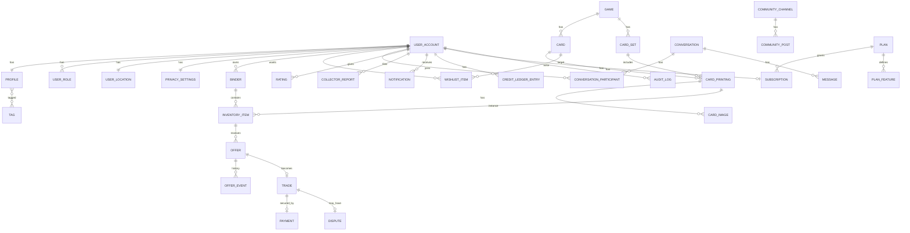

# Database schema

PostgreSQL 17 + PostGIS 3.5. Flyway migrations live in
`apps/api/src/main/resources/db/migration`. This document is kept in sync with migrations;
update it in the same change.

## Conventions

- Tables and columns are `snake_case`; primary keys are `uuid` (`gen_random_uuid()` or
  app-generated), never exposed sequential ids.
- Every table has `created_at timestamptz not null default now()`; mutable tables add
  `updated_at`. Soft-delete columns are named `deleted_at`.
- Enumerations are `text` columns with `CHECK` constraints (easier to evolve than PG enums).
- Money: `numeric(12,2)` + `currency char(3)`. Never floats.
- Geography: `geography(Point, 4326)` with GiST indexes. Distances in metres via `ST_DWithin`.
- Game-specific data: `jsonb` with GIN indexes when filtered.
- Search: generated `tsvector` columns + `pg_trgm` GIN indexes.
- Migration naming: `V<NNN>__<snake_case_description>.sql`, three-digit zero padded. Repeatable
  migrations (`R__`) only for views/functions. Never modify an applied migration.
- Seed data is not a migration; it lives in `db/seed/*.sql` and runs from `SeedDataRunner`
  under `local`/`dev` profiles only.

## Privacy-sensitive fields

| Table.column | Sensitivity | Rule |
| --- | --- | --- |
| `user_location.home_point` | Precise location | Never read outside `location` module, never serialised |
| `user_location.trading_area_center` | Approximate, user-chosen | Private |
| `user_location.public_point` | Derived imprecise | The only geography public queries may use |
| `user_account.email` | PII | Only owner + admins; hashed in analytics |
| `message.body`, `message_attachment` | Private content | Participants + moderators acting on a report |
| `payment_*` | Financial | Provider tokens only; never card numbers |

## Entity overview

Detailed column lists are appended per phase below as migrations land.

## Migrations

| Version | Purpose |
| --- | --- |
| V001 | Extensions (`postgis`, `pg_trgm`, `unaccent`, `pgcrypto`), helper functions |

(Sections for later phases are added as they are implemented.)
