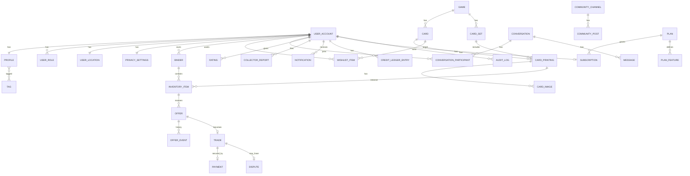

# Database schema

PostgreSQL 17 + PostGIS 3.5. Flyway migrations live in
`apps/api/src/main/resources/db/migration`. This document is kept in sync with migrations;
update it in the same change.

## Conventions

- Tables and columns are `snake_case`; primary keys are `uuid` (`gen_random_uuid()` or
  app-generated), never exposed sequential ids.
- Every table has `created_at timestamptz not null default now()`; mutable tables add
  `updated_at`. Soft-delete columns are named `deleted_at`.
- Enumerations are `text` columns with `CHECK` constraints (easier to evolve than PG enums).
- Money: `numeric(12,2)` + `currency char(3)`. Never floats.
- Geography: `geography(Point, 4326)` with GiST indexes. Distances in metres via `ST_DWithin`.
- Game-specific data: `jsonb` with GIN indexes when filtered.
- Search: generated `tsvector` columns + `pg_trgm` GIN indexes.
- Migration naming: `V<NNN>__<snake_case_description>.sql`, three-digit zero padded. Repeatable
  migrations (`R__`) only for views/functions. Never modify an applied migration.
- Seed data is not a migration; it lives in `db/seed/*.sql` and runs from `SeedDataRunner`
  under `local`/`dev` profiles only.

## Privacy-sensitive fields

| Table.column | Sensitivity | Rule |
| --- | --- | --- |
| `user_location.home_point` | Precise location | Never read outside `location` module, never serialised, logged or exported; not written by the Phase 1 API |
| `user_location.trading_area_center` | Approximate, user-chosen (stored at 3 decimals) | Private: returned only to the owner (`GET /me/location`, `GET /me/export`); never logged, never in events |
| `user_location.public_point` | Derived imprecise | The only geography public queries may use; `NULL` while not discoverable |
| `account_deletion_request.reason` | Free text from the owner | Never copied into the audit log; cleared when the deletion completes |
| `user_account.email` | PII | Only owner + admins; hashed in analytics |
| `message.body`, `message_attachment` | Private content | Participants + moderators acting on a report |
| `payment_*` | Financial | Provider tokens only; never card numbers |

## Entity overview

Detailed column lists are appended per phase below as migrations land.

## Migrations

| Version | File | Purpose |
| --- | --- | --- |
| V001 | `V001__extensions.sql` | Extensions (`postgis`, `pg_trgm`, `unaccent`, `pgcrypto`) and the `unaccent_immutable(text)` helper |
| V002 | `V002__event_publication.sql` | Spring Modulith 2.1 event publication registry (`event_publication`, transactional outbox) |
| V003 | `V003__users.sql` | Phase 1-A: `user_account`, `user_role`, `legal_document` (+ 8 seeded documents), `user_consent`, `audit_log`, `job_run` |
| V004 | `V004__profiles.sql` | Phase 1-B: `profile`, `tag` (+ 22 curated tags), `profile_tag`, `moderation_rule` (+ neutral placeholder banned terms), `privacy_settings`; trigram index on `user_account.handle` |
| V005 | `V005__location.sql` | Phase 1-B: `user_location` (ADR 0004: private centre, derived public point) |
| V006 | `V006__settings.sql` | Phase 1-B: `notification_preferences` |
| V007 | `V007__deletion.sql` | Phase 1-B: `account_deletion_request` |

(Sections for later phases are added as they are implemented.)

### V001 — extensions and helper functions

All statements are idempotent (`CREATE EXTENSION IF NOT EXISTS`, `CREATE OR REPLACE FUNCTION`), so
the migration also succeeds on a database that the local `docker compose` init script already
prepared.

| Object | Purpose |
| --- | --- |
| extension `postgis` | `geography(Point, 4326)` columns, `ST_DWithin`, GiST indexes (collector search) |
| extension `pg_trgm` | trigram GIN indexes for fuzzy card / collector name search |
| extension `unaccent` | accent-insensitive search (`Pokémon` matches `Pokemon`) |
| extension `pgcrypto` | `gen_random_uuid()` primary keys, `digest()` |
| function `unaccent_immutable(text) RETURNS text` | `IMMUTABLE PARALLEL SAFE STRICT` wrapper around `unaccent('public.unaccent', ...)`; required because `unaccent()` itself is only `STABLE` and therefore cannot back generated `tsvector` columns or expression indexes |

### V002 — `event_publication` (Spring Modulith outbox)

Copied verbatim from `spring-modulith-events-jdbc` 2.1.1 (`schemas/v2/schema-postgresql.sql`, the
current non-legacy structure). `spring.modulith.events.jdbc.schema-initialization.enabled` is
`false`: Flyway owns the table. Rows are written in the same transaction as the domain change and
completed (`completion-mode=update`) once every `@ApplicationModuleListener` succeeded; incomplete
rows are republished on restart. The optional `event_publication_archive` table
(`completion-mode=archive`) is not created.

| Column | Type | Notes |
| --- | --- | --- |
| `id` | `uuid` | PK |
| `listener_id` | `text` | fully qualified listener method |
| `event_type` | `text` | event class name |
| `serialized_event` | `text` | JSON (Jackson 3) |
| `publication_date` | `timestamptz` | when the event was published |
| `completion_date` | `timestamptz` | null while outstanding |
| `status` | `text` | `PUBLISHED`, `PROCESSING`, `RESUBMITTED`, `FAILED`, `COMPLETED` (managed by Modulith) |
| `completion_attempts` | `int` | retry counter |
| `last_resubmission_date` | `timestamptz` | last republish |

Indexes: `event_publication_serialized_event_hash_idx` (hash on `serialized_event`, used by
Modulith to complete publications) and `event_publication_by_completion_date_idx`
(`completion_date`, used to find outstanding / completed rows).

### V003 — accounts, roles, legal consents, audit log, job runs (Phase 1-A)

No location data lives in these tables (see ADR 0004); `user_location` arrives with the location
module. Enumerations are `text` + `CHECK` constraints; the Java side maps them with
`@Enumerated(STRING)`.

#### `user_account`

One row per identity-provider user, created on the first authenticated request
(`UserAccountService.resolve`, `INSERT ... ON CONFLICT (provider_uid) DO NOTHING`).

| Column | Type | Notes |
| --- | --- | --- |
| `id` | `uuid` | PK, app-generated (`gen_random_uuid()` default); seed accounts use `00000000-0000-4000-8000-0000000000NN` |
| `provider_uid` | `text` | Firebase uid, `UNIQUE` (`uq_user_account_provider_uid`); never shown to other users |
| `email` | `text` | PII: owner and admins only |
| `email_verified` | `boolean` | synced from the ID token on every login |
| `handle` | `text` | `[a-z0-9_]{3,24}` (`ck_user_account_handle`), unique case-insensitively via `uq_user_account_handle_lower` on `lower(handle)`; derived from the email local part with a numeric suffix on collision |
| `display_name` | `text` | initial value: provider name or the handle |
| `status` | `text` | `ACTIVE` (default), `SUSPENDED`, `DELETION_REQUESTED`, `DELETED` |
| `suspended_until` | `timestamptz` | null = indefinite; expired suspensions are lifted lazily on the next request |
| `suspension_reason` | `text` | admin-provided |
| `plan_code` | `text` | `FREE` (default) or `PREMIUM`; becomes a FK to `plan` in Phase 10 |
| `created_at`, `updated_at` | `timestamptz` | |
| `last_active_at` | `timestamptz` | written at most once per 5 minutes per user (Redis `SET NX` throttle) |
| `deleted_at` | `timestamptz` | set by the deletion job |

Indexes: `ix_user_account_email_lower`, `ix_user_account_status`, `ix_user_account_created_at`.

#### `user_role`

| Column | Type | Notes |
| --- | --- | --- |
| `user_id` | `uuid` | FK → `user_account.id` (cascade) |
| `role` | `text` | `USER`, `PREMIUM_USER`, `MODERATOR`, `ADMIN`, `SUPER_ADMIN`; PK `(user_id, role)` |
| `granted_at` | `timestamptz` | |
| `granted_by` | `uuid` | acting admin, null for provisioning/seed |

Every account keeps `USER`. Only a `SUPER_ADMIN` may grant or revoke `ADMIN`/`SUPER_ADMIN`.

#### `legal_document`

| Column | Type | Notes |
| --- | --- | --- |
| `id` | `uuid` | PK |
| `document_type` | `text` | `TERMS`, `PRIVACY`, `COMMUNITY_GUIDELINES`, `MARKETPLACE_POLICY`, `PAYMENT_PROTECTION`, `REFUND_DISPUTE`, `COOKIES`, `ACCEPTABLE_USE` |
| `version` | `text` | e.g. `2026-09-01`; `UNIQUE (document_type, version)` |
| `title`, `url` | `text` | `url` is the web path (`/legal/terms`) |
| `required_at_registration` | `boolean` | `true` for TERMS, PRIVACY, COMMUNITY_GUIDELINES, ACCEPTABLE_USE |
| `published_at` | `timestamptz` | |
| `current` | `boolean` | at most one current version per type (`uq_legal_document_current`, partial unique index) |

V003 seeds the eight documents in version `2026-09-01`. Publishing a new version = insert the row
and flip `current` in one transaction; every user then sees it in `requiredConsents` and receives
`428 TERMS_ACCEPTANCE_REQUIRED` on non-exempt routes until they accept it.

#### `user_consent`

| Column | Type | Notes |
| --- | --- | --- |
| `id` | `uuid` | PK |
| `user_id` | `uuid` | FK → `user_account.id` (cascade) |
| `document_type`, `version` | `text` | FK → `legal_document (document_type, version)`; `UNIQUE (user_id, document_type, version)` |
| `accepted_at` | `timestamptz` | |
| `ip_hash` | `text` | SHA-256 hex of `<server salt>:<client IP>` (`orenji.consents.ip-salt`); the raw address is never stored |
| `user_agent` | `text` | truncated to 512 characters |

Consents survive account deletion (the account row is anonymised instead).

#### `audit_log`

Append-only; written by `AuditService.record` inside the caller's transaction.

| Column | Type | Notes |
| --- | --- | --- |
| `id` | `uuid` | PK |
| `occurred_at` | `timestamptz` | |
| `actor_user_id` | `uuid` | acting account, null for `SYSTEM` |
| `actor_type` | `text` | `USER`, `ADMIN`, `SYSTEM` |
| `action` | `text` | dotted name: `user.suspend`, `user.unsuspend`, `user.roles.update`, `user.suspension.expired`, `consent.accept`, ... |
| `target_type` | `text` | e.g. `USER` |
| `target_id` | `text` | id of the target as text |
| `details` | `jsonb` | structured, PII-free details (never coordinates) |
| `request_id` | `text` | the `X-Request-Id` of the triggering request |

Indexes: `ix_audit_log_target (target_type, target_id)`, `ix_audit_log_actor (actor_user_id)`,
`ix_audit_log_occurred_at (occurred_at DESC)`, `ix_audit_log_action (action)`.

#### `job_run`

Execution record of internal jobs (`/internal/jobs/**`, scheduled tasks), written by
`JobRunService`.

| Column | Type | Notes |
| --- | --- | --- |
| `id` | `uuid` | PK |
| `name` | `text` | job name (`ping`, later `account-deletion`, `auto-delist`, ...) |
| `started_at`, `finished_at` | `timestamptz` | |
| `status` | `text` | `RUNNING` (default), `SUCCEEDED`, `FAILED` |
| `details` | `jsonb` | counters or an error summary |

Index: `ix_job_run_name_started_at (name, started_at DESC)`.

### V004 — profiles, tags, moderation rules, privacy settings (Phase 1-B)

#### `profile`

One row per account once the collector saved a profile, uploaded an avatar or set tags. The handle
stays on `user_account`; the display name is mirrored there (shown by `/me` and admin views).

| Column | Type | Notes |
| --- | --- | --- |
| `user_id` | `uuid` | PK, FK → `user_account.id` (cascade) |
| `display_name` | `text` | 1-80 characters (`ck_profile_display_name`); public |
| `bio` | `text` | ≤ 500 characters (`ck_profile_bio`), default `''`; public; banned-term checked (`PROFILE` rules) |
| `avatar_key` | `text` | `ObjectStorage` key `avatars/<user id>/<32 hex>.jpg` of the 512×512 re-encoded avatar; never a server path. The public URL is derived at read time (local: `GET /api/v1/public/media/{key}`, GCS: bucket URL) |
| `games` | `text[]` | game slugs `yugioh`, `pokemon`, `mtg`, `riftbound` (validated by the service until the games tables exist); ≤ 16 (`ck_profile_games`) |
| `languages` | `text[]` | ISO 639-1 codes; ≤ 10 (`ck_profile_languages`) |
| `completed_at` | `timestamptz` | first `PUT /me/profile` (onboarding flag `profileComplete`) |
| `created_at`, `updated_at` | `timestamptz` | |
| `search_vector` | `tsvector` | generated: `to_tsvector('simple', unaccent_immutable(display_name || ' ' || bio))` (collector search, Phase 4) |

Indexes: `ix_profile_search_vector` (GIN), `ix_profile_display_name_trgm` (GIN trigram on
`lower(unaccent_immutable(display_name))`), `ix_profile_games` (GIN on the array). V004 also adds
`ix_user_account_handle_trgm` (GIN trigram on `user_account.handle`).

#### `tag`

| Column | Type | Notes |
| --- | --- | --- |
| `id` | `uuid` | PK |
| `slug` | `text` | `UNIQUE` (`uq_tag_slug`), `^[a-z0-9]+(-[a-z0-9]+)*$`, ≤ 48 characters; custom labels map to the accent-free, dashed slug so "Cube Drafter" and "cube-drafter" are the same tag |
| `label` | `text` | 2-24 characters |
| `category` | `text` | `GAME`, `ROLE`, `STYLE`, `LOGISTICS`, `LANGUAGE`, `CUSTOM` |
| `status` | `text` | `ACTIVE` (default; searchable and selectable), `HIDDEN` (kept on profiles, not shown), `BANNED` |
| `usage_count` | `integer` | profiles carrying the tag; recomputed from `profile_tag` on every change (`TagRepository.recountUsage`) |
| `created_by` | `uuid` | creator of a `CUSTOM` tag, FK → `user_account.id` (`ON DELETE SET NULL`) |
| `created_at`, `updated_at` | `timestamptz` | |

Indexes: `ix_tag_label_trgm` (GIN trigram on `lower(unaccent_immutable(label))`, tag search),
`ix_tag_status_usage (status, usage_count DESC)`, `ix_tag_category`. V004 seeds 22 curated tags
(games, roles, styles, logistics, languages). `GET /tags` only returns `ACTIVE` tags, and `CUSTOM`
ones only while at least one profile uses them.

#### `profile_tag`

| Column | Type | Notes |
| --- | --- | --- |
| `profile_user_id` | `uuid` | FK → `profile.user_id` (cascade) |
| `tag_id` | `uuid` | FK → `tag.id` (cascade); PK `(profile_user_id, tag_id)` |
| `created_at` | `timestamptz` | |

Index: `ix_profile_tag_tag_id`. At most 12 tags per profile (service rule).

#### `moderation_rule`

Admin-editable text rules (ADR 0014), cached ≤ 60 s per instance by `TextModerationService`.

| Column | Type | Notes |
| --- | --- | --- |
| `id` | `uuid` | PK |
| `kind` | `text` | `BANNED_TERM` (evaluated today), `RATE_LIMIT`, `THRESHOLD` |
| `pattern` | `text` | 1-200 characters; case-insensitive regular expression matched against accent-stripped text; invalid patterns are skipped with a warning |
| `action` | `text` | `FLAG` (accepted, logged for review) or `BLOCK` (400) |
| `scope` | `text` | `MESSAGE`, `POST`, `TAG`, `PROFILE` |
| `active` | `boolean` | |
| `created_at`, `updated_by`, `updated_at` | | audit columns |

Index: `ix_moderation_rule_scope_active (scope, active)`. V004 seeds invented, neutral placeholder
terms (`zorblax`, `quuxspam`, `blorpscam` → `BLOCK` for `TAG` and `PROFILE`; `fnordpromo` → `FLAG`
for `PROFILE`) that exercise the engine locally; real lists are managed through the admin console
(admin endpoints arrive with Phase 7 moderation).

#### `privacy_settings`

A missing row means the safe defaults below.

| Column | Type | Default | Notes |
| --- | --- | --- | --- |
| `user_id` | `uuid` | | PK, FK → `user_account.id` (cascade) |
| `discoverable` | `boolean` | `false` | opt-in to the map; while `false`, `user_location.public_point` is `NULL` |
| `show_distance` | `boolean` | `true` | others see a bucketed distance |
| `show_online_status` | `boolean` | `false` | presence (Phase 5) |
| `show_last_active` | `boolean` | `true` | bucketed last activity on the public profile |
| `profile_visibility` | `text` | `MEMBERS` | `PUBLIC`, `MEMBERS`, `PRIVATE` (404 for everyone but the owner) |
| `messaging_permission` | `text` | `MEMBERS_WITH_PROFILE` | `EVERYONE`, `MEMBERS_WITH_PROFILE`, `NOBODY` |
| `wishlist_visible` | `boolean` | `false` | Phase 6 |
| `search_discoverable` | `boolean` | `true` | collector name search (Phase 4) |
| `created_at`, `updated_at` | `timestamptz` | | |

Index: `ix_privacy_settings_discoverable` (partial, `WHERE discoverable`). The rules built on these
switches live in `PrivacyPolicyService` (profiles module).

### V005 — `user_location` (ADR 0004)

Read and written only by the location module (`UserLocationRepository`, explicit PostGIS SQL).

| Column | Type | Notes |
| --- | --- | --- |
| `user_id` | `uuid` | PK, FK → `user_account.id` (cascade) |
| `home_point` | `geography(Point, 4326)` | **PRIVATE**; reserved for an explicit "use my location" flow, never written by the Phase 1 API, never selected, serialised, logged or exported |
| `trading_area_center` | `geography(Point, 4326)` | **PRIVATE**, not null; the user-chosen centre rounded to 3 decimals; returned only to its owner |
| `trading_area_radius_m` | `integer` | 1 000-50 000 (`ck_user_location_radius`) |
| `source` | `text` | `MANUAL` or `DEVICE` (only records where the centre came from; the server snaps both) |
| `public_point` | `geography(Point, 4326)` | **PUBLIC**; derived by `ApproximateLocationService`: snap to the ~1 km cell (`row = floor(lat / 0.009)`, `col = floor(lng / (0.009 / cos(row centre lat)))`), offset inside the cell by `HMAC-SHA256(LOCATION_JITTER_SECRET, user id)` with a 0.001° margin, rounded to 3 decimals. Same user + same cell ⇒ same point. `NULL` while the collector is not discoverable, pending deletion or suspended |
| `public_label` | `text` | **PUBLIC** region label of the public point (`StaticRegionGeocoder`: ~34 Montréal-area neighbourhoods and Canadian cities, offline) |
| `grid_cell` | `text` | `r<row>c<col>`; `NULL` exactly when `public_point` is (`ck_user_location_public`); the only location value analytics may carry |
| `created_at`, `updated_at` | `timestamptz` | |

Indexes: `ix_user_location_public_point` (GiST, partial `WHERE public_point IS NOT NULL`, nearby
search in Phase 4), `ix_user_location_grid_cell` (partial).

### V006 — `notification_preferences`

A missing row means the defaults (push and in-app on, email off, `MARKETING` fully off).

| Column | Type | Notes |
| --- | --- | --- |
| `user_id` | `uuid` | PK, FK → `user_account.id` (cascade) |
| `push_enabled`, `email_enabled`, `in_app_enabled` | `boolean` | master switches (`true`, `false`, `true`) |
| `categories` | `jsonb` | object `{CATEGORY: {push, email, inApp}}` keyed by `WISHLIST_MATCH`, `MESSAGE`, `OFFER`, `RATING`, `TRADE`, `BINDER_FRESHNESS`, `REPORT_DECISION`, `MARKETING`; missing keys mean the defaults, unknown keys are ignored when reading (`ck_notification_preferences_categories`: must be an object). Never filtered in SQL, so no GIN index |
| `quiet_hours` | `jsonb` | object `{enabled, start "HH:mm", end "HH:mm", timezone}` (IANA zone validated by the service), default disabled 22:00-08:00 America/Toronto |
| `created_at`, `updated_at` | `timestamptz` | |

### V007 — `account_deletion_request`

`POST /me/deletion-requests` → `PENDING` (7-day grace period, account `DELETION_REQUESTED`, every
session revoked, public traces hidden) → `account-deletion` job → `COMPLETED` (account anonymised,
module data purged by every `DeletionParticipant`, identity-provider user deleted; consents and audit
kept), or `CANCELLED` by the owner during the grace period.

| Column | Type | Notes |
| --- | --- | --- |
| `id` | `uuid` | PK |
| `user_id` | `uuid` | FK → `user_account.id` (cascade; account rows are anonymised, never deleted) |
| `status` | `text` | `PENDING`, `PROCESSING` (reserved), `COMPLETED`, `CANCELLED` |
| `reason` | `text` | optional owner text ≤ 1 000 characters; never audited; set to `NULL` on completion |
| `export_requested` | `boolean` | the owner wants their export first (`GET /me/export` stays available while pending) |
| `requested_at`, `scheduled_for` | `timestamptz` | `scheduled_for = requested_at + orenji.account.deletion-grace-days` |
| `cancelled_at`, `completed_at` | `timestamptz` | |
| `created_at`, `updated_at` | `timestamptz` | |

Indexes: `uq_account_deletion_request_active` (unique partial on `user_id` for `PENDING`/`PROCESSING`:
one active request per account), `ix_account_deletion_request_due` (partial on `scheduled_for`
`WHERE status = 'PENDING'`, used by the job with `FOR UPDATE SKIP LOCKED`),
`ix_account_deletion_request_user (user_id, requested_at DESC)`.

Anonymisation (`UserAccount.anonymise`): `email = deleted+<id>@anonymized.invalid`,
`handle = deleted_<16 hex of the id>`, `display_name = 'Deleted collector'`, status `DELETED`,
`deleted_at` set, only `USER` kept, `last_active_at` cleared. `provider_uid` is kept on purpose (the
identity is deleted at the provider; a still-valid old ID token then resolves to the `DELETED` row and
gets 403 instead of provisioning a new account), and identity attributes are never re-synced onto a
deleted row.
